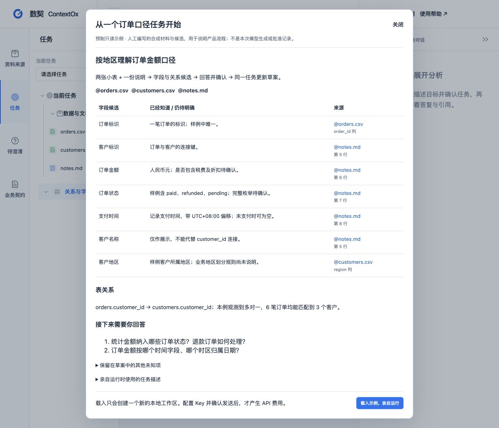

<p align="center"></p>
<h1 align="center">数契 ContextOx</h1>
<p align="center">把资料中的字段、关系和业务口径，整理成有依据、能讨论、可继续完善的定义草案。</p>
<p align="center">本地工作台 · DeepSeek Flash · 公开合成示例 · MIT</p>

数契帮助你借助 Agent 理解和规范业务与数据知识。给它两张表和一份说明，它会整理字段与表关系、标出来源，并把缺少的业务规则变成具体问题。你回答并确认后，可以在同一任务中继续完善草案。

当前阶段是 **Demo 1.0**，运行包版本为 **0.2.0**。GitHub 仓库是产品介绍、安装和反馈的入口。

## 先看它能做什么

例如，你想按地区汇总订单金额，但资料还没有说明是否纳入退款订单、按哪个时间字段归属日期。

1. 点击工作台顶部的 **体验示例**。不用 Key，也能查看明确标记的预制候选和三份合成来源。
2. 点击 **载入示例，亲自运行**，创建全新的本地工作区，并预填任务描述。
3. 配置 DeepSeek Key，确认发送任务描述，再确认任务与来源。
4. 请 Agent 整理字段、关系和问题。点击简短的 `@notes.md` 等引用，可以回到准确来源。
5. 在 **待澄清** 中回答并批准，再继续同一个任务，查看更新后的草案。
6. 在 **关系与字段** 或 **业务契约** 中导出 Markdown / JSON，带走版本、引用、回答记录和未决项。

公开示例包含 [6 笔订单](src/contextox/demo/orders.csv)、[3 个客户](src/contextox/demo/customers.csv)和[一份说明](src/contextox/demo/notes.md)，全部为合成数据。预制结果是人工编写的展示材料；亲自运行得到的内容取决于模型，仍需你核对。



*工作台实际截图。图中是明确标记的预制候选，用于先了解流程，不代表模型生成结果。*

## 安装与启动

首批运行包面向 **macOS Apple 芯片**，自带 Python、依赖和网页，无需预装 Python、Node.js 或 UV。只使用 DeepSeek，由使用者提供自己的 API Key。

**发布状态：0.2.0 仍在交付验证中，Release 尚未发布。以下固定版本安装命令将在 `v0.2.0` Release 发布后生效；当前可使用下方源码启动方式。**

发布后，整段复制到终端即可安装并打开工作台：

```sh
contextox_download=$(mktemp -d)
curl --fail --location --proto '=https' --tlsv1.2 \
  https://github.com/archerthegoat/contextox-agent/releases/download/v0.2.0/install.sh \
  --output "$contextox_download/install.sh" && sh "$contextox_download/install.sh"
```

安装程序下载固定版本并校验 SHA256，安装到 `~/.local/share/contextox`，随后启动本地服务并打开浏览器。无需管理员权限，不修改 shell 配置。再次启动：

```sh
"$HOME/.local/share/contextox/contextox" start
```

默认访问地址为 <http://127.0.0.1:8787>。保持终端运行；按 `Ctrl+C` 停止。重复启动同一资料目录会打开已有实例。端口被其他程序占用时，可以显式选择另一个端口：

```sh
"$HOME/.local/share/contextox/contextox" start --port 8788
```

这轮提供终端安装与浏览器工作台；原生 `.app`、DMG、签名和公证不在当前交付范围。

## 配置 DeepSeek

在工作台顶部点击 **配置模型**，填入自己的 Key 并保存到 **macOS Keychain**。Key 不写入工作区数据库、普通配置文件或浏览器存储；网页也不会回显已保存的 Key。保存不调用模型，首次明确发送任务时才会产生 API 费用。

- [获取 DeepSeek API Key](https://platform.deepseek.com/api_keys)。Key 是否有效、账户是否有余额，以真实请求为准。
- 已设置 `DEEPSEEK_API_KEY` 环境变量时，它优先于 Keychain，页面显示“由启动环境管理”。
- 任务正在执行时不能替换或移除 Key；结束后可刷新状态再修改。
- Keychain 无法访问时，请解锁 macOS 登录钥匙串。程序不会回退到明文文件保存。

新请求使用正式 API 名称 `deepseek-flash`，对应 [DeepSeek V4.1 Flash](https://api-docs.deepseek.com/zh-cn/updates/)。安装包默认显式启用 `demo-fast` 非思考模式；源码 CLI 的默认配置仍为生产 `high`。配置不会在运行中自动切换，历史回执保留当时记录的模型名称。

## 数据留在哪里，什么时候发送

工作区、资料、草案、回答与执行记录保存在本机：

```text
~/Library/Application Support/ContextOx/
```

升级运行包保留资料目录与旧版本。使用旧版资料目录的用户应继续显式传入 `--data-dir`；默认目录变更不会搬走旧数据。

导入和查看资料发生在本机。你确认发送后，当前任务的必要上下文才发送给 DeepSeek：表格先由 Python 统计，模型获得有界画像与少量样例；选中的说明文档和引用片段按预算提供正文。画像解释是单独的可选发送动作，不会在导入示例时自动调用。

当前单个来源上限为 **2 MiB**，表格准入上限为 **5,000 行**。服务只绑定 `127.0.0.1`，不提供远程访问、多用户协作或任意文件、SQL、Shell 执行。请只导入和发送你有权使用的材料。

## 当前能用到哪一步

| 能力 | Demo 边界 |
| --- | --- |
| 资料、表格画像和引用 | 来源版本可追溯；点击引用读取本地证据 |
| 字段与关系草案 | 可以不完整，缺项与未知继续保留 |
| 澄清与续接 | 回答、批准，再更新同一任务；普通聊天不能代替业务批准 |
| 失败后继续 | 符合无领域写入条件的纯生成失败，可由用户明确重新生成；结果未知不自动重试 |
| Markdown / JSON 导出 | 导出候选、当前版本、证据和澄清回答；不是正式 Contract |
| 正式 Contract、批准 Context 的跨任务复用 | 后续开发 |
| 大文件、Windows / Linux 运行包、其他模型供应商 | 当前不提供 |

Demo 每轮正常交互的目标是 60 秒内返回；单次 Provider 上限 70 秒，Run 上限 75 秒。完整返回但格式不合规时，Demo 至多纠正一次，两次请求共享原截止时间。少量成功案例不能证明 P95 或生产 high 的稳定性。分层测试、真实调用、代理浏览器检查和人工验收状态见 [实施与验收记录](docs/R1系统重规划与验收指标.md)。

## 从源码运行

开发需要 Python `3.14.7`、UV 和 Node.js `22.19.0` 以上版本。Python 与前端依赖均使用仓库锁定版本；安装不运行 npm 生命周期脚本。

```sh
git clone https://github.com/archerthegoat/contextox-agent.git
cd contextox-agent
uv sync --locked
npm --prefix web ci --ignore-scripts
npm --prefix web run build
uv run --locked contextox start --agent-profile demo-fast --open-browser
```

本地诊断使用 `uv run --locked contextox doctor`。`doctor` 意为环境检查：核对 Python、依赖、API 合同及网页资源，不读取凭据或调用模型，因此整体 `partial` 和 Provider `not_run` 可以是正常结果。

开发检查：

```sh
uv run --locked python -m compileall -q src tests
uv run --locked python -m unittest discover -s tests
npm --prefix web run check:api
npm --prefix web run typecheck
npm --prefix web test
npm --prefix web run build
```

新资料库使用 schema v6。已有资料需要迁移时，先停止旧服务、保留备份并按 [架构与迁移报告](docs/架构与迁移报告.md) 执行；不要通过恢复旧备份丢弃新记录。多个版本应使用各自匹配的静态资源目录。

## 构建固定版本运行包

维护者在 macOS arm64、干净的已提交源码上构建：

```sh
uv sync --locked
npm --prefix web ci --ignore-scripts
uv run --locked python scripts/build_release.py --output-dir /absolute/path/outside-repository
```

输出压缩包、`SHA256SUMS` 和 `install.sh`。包内 `BUILD.json` 记录源码 commit、内容指纹与依赖锁指纹；构建脚本校验官方 Python 归档并从锁定依赖组装，不复制开发虚拟环境或工作区。`--allow-dirty` 仅用于明确标记的开发验证，不能用作正式发布构建。脚本不会创建标签或上传 Release。

发布前可通过 `sh scripts/install.sh --archive <压缩包路径> --sha256 <校验值> --install-dir <独立验证目录> --no-start` 验证离线安装。升级前停止服务；出现问题时保留资料目录与旧包，使用兼容的旧运行包或修正版本恢复，不降级数据库历史。

## 反馈与开发方向

欢迎通过 [GitHub Issues](https://github.com/archerthegoat/contextox-agent/issues) 反馈：你想完成什么任务、在哪一步卡住、看到什么结果。请附运行包版本和脱敏的错误代码，不要上传 Key、私有资料库、客户数据或原始 Provider 内容。

数契的目标是把业务对象、证据、澄清、确认、版本和交付物组织成可直接使用的流程。与通用 Agent 配合 Skills、项目上下文和模板的效果差异，仍需要实际案例验证。

- [开发路径图](开发路径图.md)：产品方向与后续开发顺序。
- [架构与迁移报告](docs/架构与迁移报告.md)：已批准的状态、权限、失败和恢复语义。
- [R1 实施与验收记录](docs/R1系统重规划与验收指标.md)：当前切片、历史试验和待验项。
- [任务对话交付记录](docs/任务对话A-D交付与验收.md)：此前任务对话的实现与验证。

完整品牌和独立官网在产品方向验证后再推进。当前统一沿用工作台 Logo，以这个 GitHub 仓库作为入口。

## 许可证

项目采用 [MIT License](LICENSE)。运行包中保留 Python、后端依赖、React/Vite 及图标的第三方许可证与声明。公开示例为人工合成材料，不构成真实业务规则或批准。
