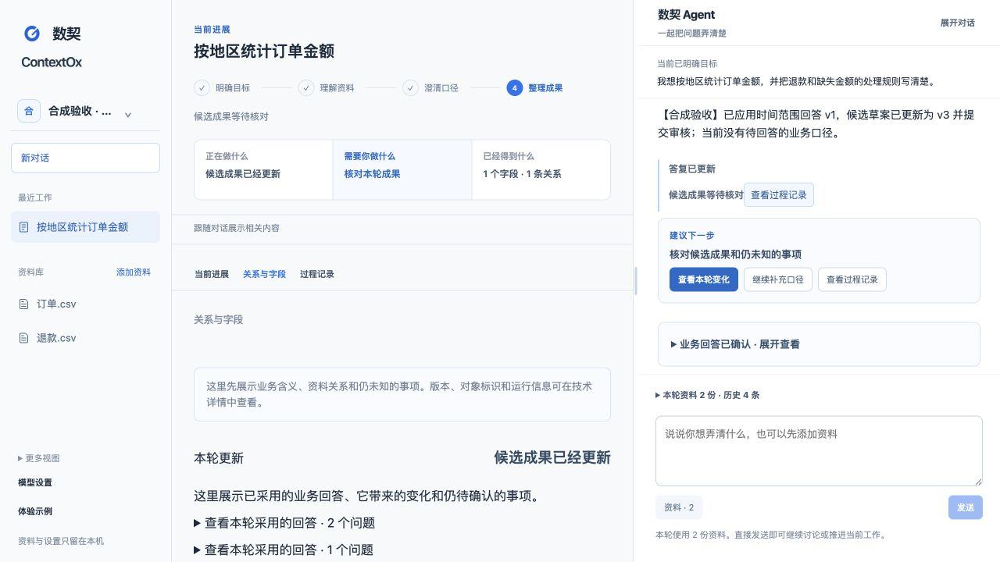

<h1 align="center">数契 ContextOx</h1>

<strong>把散落在表格和说明里的业务口径，聊清楚、写清楚、留出处。</strong>

本地优先 · Agent 对话驱动 · DeepSeek · 公开合成示例 · MIT

数契是一个本地优先的业务定义 Agent。你把有权使用的表格和说明加入一次对话，说出想解决的问题；Agent 会理解字段和关系、定位依据，并把真正会改变结论的地方交给你确认。中间工作区持续展示进度、资料和候选成果。

首个对外推广版本定为 **1.0.0**。当前仓库中的 `v1.0.0` Release 仍是发布草案，尚未创建标签或上传安装包。

## 三分钟看懂怎么用

1. 打开工作台，从右侧直接说目标。还没想清楚时，也可以先让 Agent 了解资料。
2. 点击 **添加资料**，或展开输入框旁的 **资料**，明确选择本次对话使用的版本。系统不会把整个工作区悄悄交给模型。
3. 目标和资料足够明确后，发送消息就会开始分析，无需先创建 Mission、Provider 或 Run。
4. 遇到退款、空值、时间范围等业务判断时，继续追问原因，或用自然语言回答。
5. Agent 会把回答整理成可修改卡片。点击 **确认并继续** 后，回答才会被采用并进入下一轮分析。
6. 中间区域会说明正在做什么、需要你做什么、已经得到什么；字段、关系、变化和未知事项都可以继续核对。

第一次使用可以点击 **体验示例**。只读预览不需要 Key；“亲自运行”会创建一个新的本地工作区，并使用公开合成材料。

*工作台截图使用公开合成数据。候选内容用于展示流程，不代表真实业务规则或人的批准。*

查看一条完整合成链路的候选成果

这条固定合成链路覆盖资料选择、任务前讨论、发送即分析、澄清、回答卡片、一次确认续接和候选成果更新。它属于工程与浏览器证据，不代表真实模型质量、正式 Contract 发布或人工验收。

## 它现在能做什么

| 你要做的事 | 数契的处理方式 |
| --- | --- |
| 先弄懂几份资料 | 在同一对话解释字段、样例和可能关系，并定位来源 |
| 整理一个业务指标 | 生成字段含义、粒度、规则、时间与空值口径的候选 |
| 处理有争议的规则 | 把问题、影响、回答来源和仍未知事项整理成卡片 |
| 继续完善结果 | 采用经确认的回答，生成可对比的新候选 |
| 回看为什么这样写 | 从引用定位到精确资料版本和证据片段 |
| 带走当前成果 | 导出 Markdown 或 JSON 候选，保留未知项和核对信息 |

这些成果始终是**可核对的候选草案**。1.0.0 不会把 Agent 输出直接当成正式业务事实，也不包含正式 Contract 发布。

## 安装与启动

首个运行包面向 **macOS Apple 芯片**，自带 Python、依赖和网页，无需预装 Python、Node.js 或 UV。只使用 DeepSeek，由使用者提供自己的 API Key。

**发布状态：`v1.0.0` 尚未发布。** Release 创建后，下面的固定版本命令才会生效；现在请使用“从源码运行”。

~~~sh
contextox_download=$(mktemp -d)
curl --fail --location --proto '=https' --tlsv1.2 \
  https://github.com/archerthegoat/contextox-agent/releases/download/v1.0.0/install.sh \
  --output "$contextox_download/install.sh" && sh "$contextox_download/install.sh"
~~~

安装程序会下载并校验固定版本，安装到 `~/.local/share/contextox`，随后启动本地服务并打开浏览器。无需管理员权限，也不会修改 shell 配置。再次启动：

~~~sh
"$HOME/.local/share/contextox/contextox" start
~~~

默认地址是 <http://127.0.0.1:8787>。保持终端运行，按 `Ctrl+C` 停止。端口被占用时可运行：

~~~sh
"$HOME/.local/share/contextox/contextox" start --port 8788
~~~

原生 `.app`、DMG、签名和公证暂不包含在 1.0.0 中。

## 配置模型

在左下角打开 **模型设置**，填入 DeepSeek API Key。Key 默认保存到 **macOS Keychain**，不会写入工作区数据库、浏览器存储或普通配置文件，页面也不会回显已保存的 Key。

发送消息需要模型时，若尚未连接，原消息会保留。设置表单会明确区分 **仅保存设置** 与 **保存并发送这条消息**。只有实际发送给模型才可能产生费用。

- [获取 DeepSeek API Key](https://platform.deepseek.com/api_keys)
- 配置优先级：`DEEPSEEK_API_KEY` 环境变量 → `--env-file` 指定文件 → Keychain
- 程序不会自动寻找 `.env`；网页不会创建、修改或回显配置文件
- 任务正在执行时不能替换或移除 Key

开发者如需显式文件，可创建一个权限受限的 UTF-8 文件：

~~~dotenv
DEEPSEEK_API_KEY=your-deepseek-api-key
~~~

~~~sh
chmod 600 contextox.env
"$HOME/.local/share/contextox/contextox" start --env-file ./contextox.env
~~~

## 数据与隐私

工作区、资料、对话、草案、回答和执行记录保存在本机：

~~~text
~/Library/Application Support/ContextOx/
~~~

导入与预览在本机完成。你发送消息后，只有本轮明确选择的资料范围和必要上下文会交给 DeepSeek。表格先由本地 Python 生成有界画像，模型只收到受预算限制的样例、正文与引用。

单个来源上限为 **2 MiB**，表格准入上限为 **5,000 行**。服务只绑定 `127.0.0.1`，不提供远程访问、多用户协作、任意文件枚举、SQL 或 Shell 执行。请只导入和发送你有权使用的材料。

## 1.0.0 的边界

| 状态 | 说明 |
| --- | --- |
| 已包含 | 连续对话、精确资料范围、发送即推进、澄清卡片、批准续接、字段和关系候选、引用、导出、失败核对 |
| 暂不包含 | 正式 Contract 发布、跨任务知识复用、云同步、多用户协作、其他模型供应商、Windows / Linux 运行包 |
| 仍需单独验证 | 真实模型在更多案例中的稳定性、用户价值、正式人工验收 |

工程测试、合成 Provider、真实 Provider、浏览器检查和人工验收分别记录，低层检查不会自动提升为高层 PASS。当前证据见 [Agent 主导 Workbench 本地验收](docs/Agent主导Workbench本地验收.md)和 [R1 实施与验收记录](docs/R1系统重规划与验收指标.md)。

## 从源码运行

开发环境需要 Python `3.14.7`、UV 和 Node.js `22.19.0` 以上版本。依赖使用仓库锁定版本，npm 安装不运行生命周期脚本。

~~~sh
git clone https://github.com/archerthegoat/contextox-agent.git
cd contextox-agent
uv sync --locked
npm --prefix web ci --ignore-scripts
npm --prefix web run build
uv run --locked contextox start --agent-profile demo-fast --open-browser
~~~

本地诊断：

~~~sh
uv run --locked contextox doctor
~~~

`doctor` 只检查环境、依赖、API 合同和网页资源，不读取凭据或调用模型；总体 `partial`、Provider `not_run` 可以是正常结果。

常用开发检查：

~~~sh
uv run --locked python -m compileall -q src tests
uv run --locked python -m unittest discover -s tests
npm --prefix web run check:api
npm --prefix web run typecheck
npm --prefix web test
npm --prefix web run build
~~~

新资料库使用 schema v7。旧资料库迁移前请停止旧服务、保留备份，并按 [架构与迁移报告](docs/架构与迁移报告.md)执行。

维护者：构建固定版本运行包

~~~sh
uv sync --locked
npm --prefix web ci --ignore-scripts
uv run --locked python scripts/build_release.py --output-dir /absolute/path/outside-repository
~~~

构建必须来自干净、已提交的 macOS arm64 源码。脚本会输出压缩包、`SHA256SUMS` 和 `install.sh`，但不会创建标签或上传 GitHub Release。`--allow-dirty` 只用于明确标记的开发验证。

## 反馈与项目资料

欢迎通过 [GitHub Issues](https://github.com/archerthegoat/contextox-agent/issues) 反馈你想完成什么、在哪一步卡住、看到什么结果。请附版本和脱敏错误信息；不要上传 Key、私有资料库、客户数据或原始 Provider 内容。

- [1.0.0 Release 草案](docs/releases/v1.0.0.md)
- [开发路径图](开发路径图.md)
- [架构与迁移报告](docs/架构与迁移报告.md)
- [Agent 主导 Workbench 本地验收](docs/Agent主导Workbench本地验收.md)

建议的 GitHub About：

> 本地优先的业务定义 Agent：把表格和说明里的字段、关系与业务口径整理清楚，Agent 找证据、提出问题，人来确认关键结论。

## 许可证

项目采用 [MIT License](LICENSE)。运行包保留 Python、后端依赖、React/Vite 和图标的第三方许可证与声明；公开示例全部为人工合成材料，不构成真实业务规则或批准。
