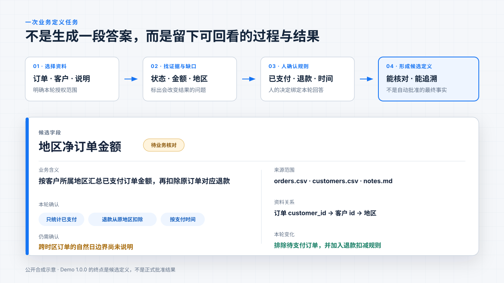

<h1 align="center">数契 ContextOx</h1>

<strong>让每一张表，都说清自己代表什么。</strong>

把散落在表格、说明和人脑中的业务规则，整理成有证据、可确认、能继续交付的候选定义。

<code>Demo 1.0.0</code> · 本地优先 · 对话驱动 · MIT 开源

  <a href="https://archerthegoat.github.io/contextox-agent/">动态产品介绍</a> ·
  <a href="https://archerthegoat.github.io/contextox-agent/downloads/contextox-demo-1.0.0-product-film.mp4">45 秒产品演示</a> ·
  <a href="README.en.md">English</a> ·
  <a href="https://github.com/archerthegoat/contextox-agent/releases/tag/v1.0.0">获取 Demo 1.0.0</a>

  <a href="#problem">先看问题</a> ·
  <a href="#workflow">工作方式</a> ·
  <a href="#result">最终成果</a> ·
  <a href="#scenarios">适用场景</a> ·
  <a href="#difference">产品区别</a> ·
  <a href="#start">开始体验</a>

## 三个数都能算出来，真正没说清的是规则

**同一份订单数据，华东金额到底是 689 元、440 元，还是 390 元？**

| 689 元 | 440 元 | 390 元 |
| --- | --- | --- |
| 所有状态直接相加 | 只统计已支付订单 | 已支付金额再扣除退款 |

三个答案都有算法。真正影响结果的是：**哪些订单算进去、退款怎么处理、按哪个时间。**

现实里的业务问题也常常如此。一句“按地区统计订单金额”看起来很明确，真正开始做时才会发现，定义散落在字段、说明、历史代码和不同人的经验里。大家各自补上了一套默认理解，于是数字能算出来，却难以解释为什么这样算、谁决定过、以后还能不能继续用。

数契是一个本地优先的业务定义智能体。你选择资料、说出目标；它负责阅读证据、找出缺口，把会改变结果的问题交给人决定，再留下可以回看的候选定义。

> **模型负责理解、整理和追问；业务事实仍由人确认。**

*689、440、390 来自仓库中的公开合成资料，用于解释规则差异，不是客户数据，也不是数契已经执行并验证的业务计算结果。*

## 14 秒看懂一次完整工作过程

| 01 选资料 | 02 说目标 | 03 人确认 | 04 看成果 |
| --- | --- | --- | --- |
| 明确这次允许查看哪些表格和说明 | 像和同事一样描述要解决的问题 | 智能体找出会改变结果的规则，由人回答 | 回看候选字段、资料关系、出处、变化和未知事项 |

打开工作台，选中订单表、客户表和说明，然后直接发送：

> 我想按地区统计订单金额，并把退款和缺失金额的处理规则写清楚。

资料与目标足够明确时，发送消息就会推进。遇到证据无法决定的业务规则，智能体会停下来说明为什么要问、不同回答会影响什么；人的回答会先被整理成可核对的卡片，确认后再继续更新候选成果。

没有模型密钥也可以点击 **体验公开示例**，先查看一份已经完成的合成候选成果，再亲自走一遍完整流程。

查看当前工作台静态大图

## 最后留下的，不只是一段对话

一次任务完成后，重要的不是智能体说了多少，而是后来的人还能不能回答这些问题：

- **它代表什么：** 字段、指标、关系或规则的业务含义是什么？
- **依据在哪里：** 使用了哪些资料版本，引用了哪一行、哪一段或哪个字段？
- **人决定了什么：** 哪些规则不能从数据推断，由谁在本轮确认？
- **这次改了什么：** 回答前后，候选定义发生了哪些变化？
- **还有什么不知道：** 哪些缺口、例外和风险仍然没有解决？

Demo 1.0.0 的终点是**可核对的候选定义**，不是正式批准的企业定义。正式发布、跨任务批准知识复用、负责人和适用范围治理，以及下游自动交付，仍属于后续方向。

## 不是只有报表对不上时才需要它

数契面向的是一类共同任务：资料已经不少，但真正决定结果的业务意思还没有被完整写下来。

| 当你遇到 | 可以带入的资料 | 数契帮助梳理 | 当前形成的结果 |
| --- | --- | --- | --- |
| **同一个数字有多种算法** | 订单、退款、客户表和指标说明 | 状态范围、退款归属、时间口径、地区来源 | 带出处和未知事项的候选字段与规则 |
| **准备调整埋点、数仓或分析逻辑** | 事件表、DDL、查询、说明和性能记录 | 事件唯一键、去重层级、用户标识、时间窗口、漏斗顺序 | 改造前需要确认的定义、证据与验收问题 |
| **要把业务需求交给 Codex 或数据团队实现** | 需求文档、样例数据、表结构和历史讨论 | 粒度、身份、时间、映射、例外与缺失处理 | 可人工交接的候选定义，减少执行阶段继续猜测 |

例如，在日均数亿条埋点的行为分析系统里，表模型、排序、索引、预聚合和漏斗计算看起来都是性能选择，背后却同时包含事件怎样去重、用户怎样识别、跨天怎样合并、漏斗怎样判定，以及如何证明结果没有算错。数契当前不会替你优化数据库；它帮助你在动代码之前，先把这些决定、依据和待确认问题整理清楚。

公开合成案例也可以作为一次业务定义练习：学习者不仅要得到答案，还要能解释判断依据、识别仍缺少的信息，并在新案例中重新完成关键步骤。练习中的确认只代表模拟裁决，不会被写成真实企业事实。

这些都是产品希望验证的任务类型，不是客户案例、性能基准或已经证明的提效结果。

## 和 Codex、问数工具、数据平台有什么区别

数契不试图替代这些工具。它聚焦的是它们之前经常被忽略的一步：**当目标看起来明确、业务定义其实还有多种理解时，先把意思说清楚。**

| 工具类型 | 通常从哪里开始 | 主要产出 | 和数契的关系 |
| --- | --- | --- | --- |
| **通用智能体，如 Codex、Claude Code** | 一个需要完成的目标，以及可用的代码和上下文 | 代码、研究、文档或其他任务结果 | 定义明确后适合继续执行；配置充分时也能完成定义整理，是数契必须正面对比的基线 |
| **BI 与问数工具** | 已经建设好的指标体系或语义模型 | 查询结果、图表和分析 | 擅长回答“现在是多少”；数契先处理“这个数究竟应该怎么算” |
| **数据目录与治理平台** | 企业元数据、血缘、权限和资产目录 | 可发现、可管理的数据资产 | 数契未来可以读取这些上下文，但不重复建设企业数据底座 |
| **数契当前方向** | 一组授权资料，以及仍存在多种理解的业务问题 | 有证据、有人确认、保留变化与未知的候选定义 | 作为业务、数据与后续执行工具之间的定义交接层 |

数契真正下注的不是聊天界面、提示词、资料读取或“拥有记忆”。这些能力通用智能体同样可以具备。它更关注把下面几件事做成稳定的产品状态：

1. 定义必须能回到证据，而不是只给出听起来合理的结论。
2. 证据不能决定的地方，要转成具体、可回答、能说明影响的问题。
3. 人的回答、候选内容、已确认事实和仍未知事项必须保持区别。
4. 每次变化都应留下版本、原因和可复核路径，之后才能安全复用或交接。

这仍是**待验证的产品差异化**，不是已经成立的绝对优势。数契会使用同一材料、任务和时间边界，与配置合理的 Codex／Claude Code 比较关键遗漏、澄清质量、人工修改和后续复用成本；如果结果和总投入相当，就应如实保留结论并重新评估产品价值。

## 现在、接下来和更远处

| 阶段 | 要解决的问题 | 状态 |
| --- | --- | --- |
| **现在：把一次争议说清楚** | 在本地选择资料、连续对话、提出澄清、确认回答，形成字段和关系候选，回看出处、变化和未知事项 | Demo 1.0.0 已提供；真实业务价值仍待验证 |
| **接下来：让确认过的定义可以复用** | 补齐适用范围、版本、负责人和验收条件，在后续任务中使用已批准内容而不是重新猜测 | 产品方向，尚未作为 1.0.0 能力交付 |
| **更远处：让定义参与真实交付** | 把已确认定义交给 Codex、数据团队或其他工程智能体，把实现与验证结果接回同一条记录 | 长期愿景，取决于真实任务和安全边界 |
| **有实际需要后：连接企业上下文** | 在权限、范围、版本和审计可控时，只读连接数据库元数据、数据目录和业务文档 | 条件性方向，不预先建设连接器生态 |

数契想成为业务、数据与智能体之间的**定义交接层**：让每个字段、指标和数据改造都能回答，它代表什么、依据在哪里、谁做了决定、改了什么，以及怎样证明没有算错。

它不是一个更会写 SQL 的聊天框，也不会为了远期愿景提前变成数据目录、权限平台、通用编程智能体或生产数据库操作工具。

## 开始体验

### 先看公开演示

- [打开动态产品介绍](https://archerthegoat.github.io/contextox-agent/)：无需安装，了解问题、过程、区别和边界。
- [观看 45 秒产品演示](https://archerthegoat.github.io/contextox-agent/downloads/contextox-demo-1.0.0-product-film.mp4)：连续查看一轮工作台操作。
- [English dynamic introduction](https://archerthegoat.github.io/contextox-agent/presentation-en.html#1)：英文版动态 HTML、对比和产品边界。
- [English product film](https://archerthegoat.github.io/contextox-agent/downloads/contextox-demo-1.0.0-product-film-en.mp4)：英文字幕与同一套 45 秒工作流。
- [English presentation PDF](https://archerthegoat.github.io/contextox-agent/downloads/contextox-demo-1.0.0-presentation-en.pdf) · [English one-pager](https://archerthegoat.github.io/contextox-agent/downloads/contextox-demo-1.0.0-one-pager-en.pdf)
- [查看 Demo 1.0.0 Release](https://github.com/archerthegoat/contextox-agent/releases/tag/v1.0.0)：当前提供源码和公开合成示例。

### 在本机运行

需要 Python `3.14.7`、[UV](https://docs.astral.sh/uv/) 和 Node.js `22.19.0` 以上版本：

~~~sh
git clone https://github.com/archerthegoat/contextox-agent.git
cd contextox-agent
uv sync --locked
npm --prefix web ci --ignore-scripts
npm --prefix web run build
uv run --locked contextox start --agent-profile demo-fast --open-browser
~~~

服务默认打开 <http://127.0.0.1:8787>。保持终端运行，按 `Ctrl+C` 停止。当前 Release 还没有预构建安装包；首次体验请按源码方式启动。

公开示例不需要模型密钥。亲自分析资料时，在工作台左下角打开 **模型设置**，填入自己的 DeepSeek 模型密钥。默认保存在 macOS Keychain，不会写入工作区数据库或浏览器存储；保存设置本身不会调用模型，只有发送消息才可能产生费用。

通过环境变量或本地配置文件提供模型密钥

读取顺序为：`DEEPSEEK_API_KEY` 环境变量 → `--env-file` 指定文件 → macOS Keychain。

~~~dotenv
DEEPSEEK_API_KEY=your-deepseek-api-key
~~~

~~~sh
chmod 600 contextox.env
uv run --locked contextox start --agent-profile demo-fast --env-file ./contextox.env --open-browser
~~~

程序不会自动寻找 `.env`，网页也不会创建或改写配置文件。

## 数据与能力边界

| 需要知道的事 | Demo 1.0.0 的处理方式 |
| --- | --- |
| **资料范围** | 只处理你在当前工作区明确选择和授权的资料，不枚举任意路径 |
| **本地保存** | 工作区、资料、对话、草案、回答和执行记录保存在 `~/Library/Application Support/ContextOx/` |
| **发送给模型** | 导入与预览在本机完成；发送消息后，只有本轮选定范围内、受预算限制的必要上下文会交给 DeepSeek |
| **服务边界** | 只绑定 `127.0.0.1`，不提供远程访问、云同步或多人协作 |
| **执行权限** | 不提供任意文件、SQL、Shell 或代码执行，不写生产数据库 |
| **成果状态** | 字段、关系和规则始终是待核对的候选内容，不自动成为正式企业定义 |

**当前已经包含：** 连续对话、精确资料范围、发送即推进、澄清卡片、回答确认、字段与关系候选、引用、导出和失败恢复。

**当前暂未包含：** 正式定义发布、跨任务批准知识复用、云同步、多用户协作、其他模型供应商，以及 Windows／Linux 运行包。

工程测试、合成模型响应、真实模型试跑、浏览器检查、人工验收和真实用户价值会分别记录，不互相替代。请只导入和发送你有权使用的资料。

## 带一个真实问题，一起把它做成

数契现在最需要的不只是更多代码，还需要那些真正发生在指标会、数据仓库、BI、数据治理和交付现场里的问题：**同一个词为什么有三种算法？这列到底该听谁的？改完以后谁会受影响？**

- 带一个可以脱敏或改写为合成数据的问题，一起打磨产品。
- 贡献业务定义方法、演示案例、交互建议、代码、测试或文档。
- 在 [GitHub Issues](https://github.com/archerthegoat/contextox-agent/issues) 留下问题，或联系维护者 [@archerthegoat](https://github.com/archerthegoat)。中文和英文都可以。

提交案例时请只使用合成或已脱敏材料，不要上传模型密钥、客户资料、私人数据或原始模型响应。

<strong>面向贡献者：架构、目录与检查</strong>

### 最小架构

~~~text
浏览器 Workbench
       │ HTTP / SSE
       ▼
本地 Python 服务 ── SQLite 状态与审计
       │ 受限请求
       ▼
配置的模型服务
~~~

ContextOx 自己负责资料范围、任务状态、澄清、确认、证据、持久化和完成语义；模型只在受限上下文中参与理解、整理和工具选择。模型停止输出不等于任务完成，普通聊天也不会自动成为已确认事实。

### 仓库目录

~~~text
src/contextox/   Python 服务、业务状态与智能体循环
web/             React + TypeScript 工作台
site/            动态产品介绍与 GitHub Pages 内容
video/           45 秒产品演示的 Remotion 工程
tests/           Python 标准库测试
scripts/         生成、检查、演示与发布脚本
docs/            架构、验收、交付记录与展示素材
~~~

### 本地检查

~~~sh
uv run --locked contextox doctor
uv run --locked python -m compileall -q src tests
uv run --locked python -m unittest discover -s tests
npm --prefix web run check:api
npm --prefix web run typecheck
npm --prefix web test
npm --prefix web run build
~~~

### 进一步阅读

- [Demo 1.0.0 Release 说明](docs/releases/v1.0.0.md)
- [开发路径图](开发路径图.md)
- [架构与迁移报告](docs/架构与迁移报告.md)
- [Agent 主导 Workbench 本地验收](docs/Agent主导Workbench本地验收.md)

## License

[MIT](LICENSE) · 公开示例全部为人工合成材料。
