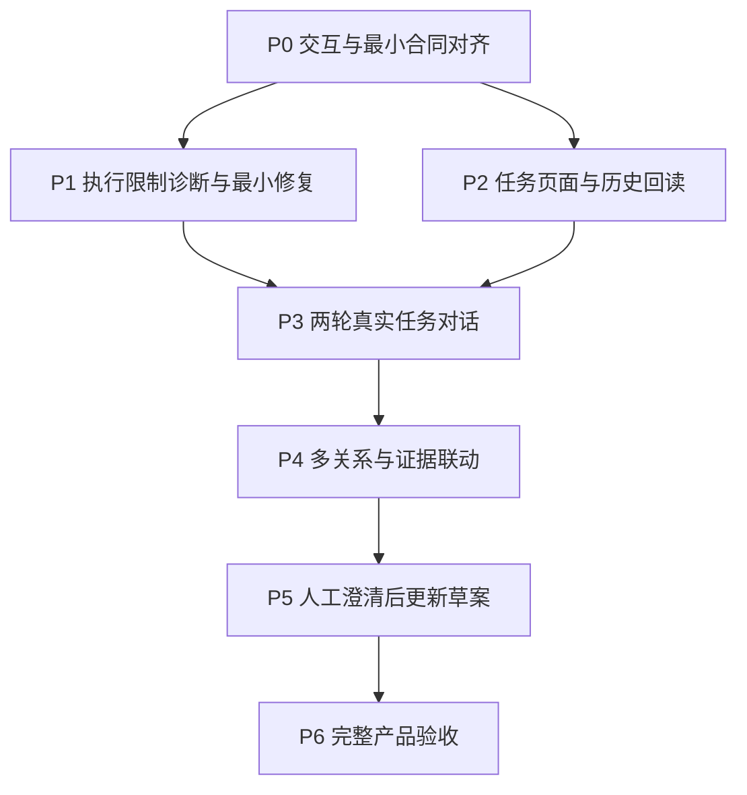

# Agent 任务协作开发实施计划

## 0. 现行定位与开发规划对齐（2026-09-07）

定位基准：`79fe09b`，已按人批准的精确补丁更新目标用户、共同任务与差异化目标。本节依据同一轮“对齐现有项目规划与开发计划”的授权整理阅读入口和既有路径对应关系，不新增产品接口、实施合同或开发顺序。

**阅读边界：** 下方从“日期：2026-09-06”开始的原文是 `ec3142a` 上的规划与交付快照。其中“当前”“下一步”、P0 待批、API 缺口、服务状态和 Git 状态只描述当时的检查点。后续已批准或已实现的内容按以下合同和交付记录核对；原日期、哈希、失败和验收记录保持原文。

### 0.1 权威与现行阅读入口

1. [开发路径图](../开发路径图.md)第一节定义三类用户与差异化目标，第五节定义路径和通过门。
2. [架构与迁移报告](架构与迁移报告.md)继续约束权限、领域状态、失败恢复和完成语义；其 2026-09-02 版本头及第 3.1 节中的实现状态属于原架构决策时的基线，功能现状按后续精确交付记录核对，不能重新推导为尚未实现。
3. [路径二共享契约](路径二共享契约.md)第 14 节已采用 [P0 任务对话与执行续接契约](proposals/P0-任务对话与执行续接契约-v1.md)，采用哈希为 `6a90167c33e356da857ad9b104d5589fed2ef0325c3184cb3c19f82be5786df1`。该原始提案的 `PROPOSED` 文案保留其批准前快照，不能据此重复要求冻结同一合同，也不能修改原文破坏采用哈希。
4. 实现与验收分别读取 [A–D 交付记录](任务对话A-D交付与验收.md)、[独立验收更正](任务对话独立验收-2026-09-06.md)、[修复复验](任务对话修复复验-2026-09-06.md)、[R0 交付记录](R0修正交付与验证-2026-09-07.md)及 [R1 真实验证记录](R1任务草案修复与真实验证-2026-09-07.md)，以各自精确提交和实际检查范围为准。

旧方案、W0–W3 与 P2-R2 执行卡保留各自检查点的有效约束和历史回执；旧“尚未实现”、派发配置、文件哈希和调用许可不能被当作今天的状态或下一批授权。发生合同冲突时回报具体冲突，不自行采用更宽权限。

### 0.2 三类用户共用的产品任务

| 使用目的 | 既有流程如何承接 | 需要分别判断的结果 |
| --- | --- | --- |
| 实际项目交付 | 导入授权资料，核对实体、字段和关系，向负责人澄清并交付定义 | 定义质量、遗漏、人工修改和沟通往返 |
| 整理自有业务 | 用相同流程整理自己的数据库含义、指标口径、业务规则及例外 | 定义能否维护、交接和在后续任务中复用 |
| 学习、转型与求职 | 围绕公开或合成案例理解证据、练习提问并解释定义取舍 | 能否解释判断，并在新案例中独立完成关键步骤 |

三类用户均沿用既定 Workspace 隔离、来源授权和 `local-owner` 边界；职位名称不授予业务裁决权。练习材料和模拟回答必须明确标记，练习确认不等于真实企业批准。本次对齐不新增角色或练习类型字段；公开练习、分步提示与反例反馈仍是路径图中的候选，具体功能另行对齐。首个高潜客户案例继续承担已有验证任务。

### 0.3 差异化与既有开发路径的对应关系

| 路径 | 既有检查点或后续范围 | 对应的用户价值与完成边界 |
| --- | --- | --- |
| 路径 2：资料理解、任务对话与关系/字段草案 | 本计划 P0–P4；实际任务对话实施按已批准 P0 的 A–D | 业务对象能定位证据，展示候选、冲突和未知；同一任务至少两轮交互并形成可追溯草案，存在未决问题时给出具体澄清。单次 Run 或输入框可用不足以完成当前路径 2 |
| 路径 3：完整业务定义闭环 | 本计划 P5 与 P6 覆盖“回答获准后改变草案”的增量；正式 Contract 与 Mission 完成仍按路径 3 | 人能核对回答对定义的影响，并最终获得可交接的业务定义包。原 P6 的“完整产品验收”只验收该批范围，不代表整个 V0 完成 |
| 路径 4：批准知识复用 | 后续路径，超出本计划原 P0–P6 范围 | 第二个任务复用仍有效的批准定义，来源变化、撤销和冲突不能静默沿用 |
| 路径 5：稳定演示与提效验证 | 沿用路径图的比较安排 | 与合理配置的 Codex、Claude Code 比较结果和总投入；功能检查、模型表现、人工判断和收益分别记录 |
| 路径 6：真实试点 | FDE 保留为首个实际交付试点场景 | 验证重复使用与实际收益；本次不把其他人群试点或学习效果设成新的前置门 |

差异化比较使用相同材料、任务和明确预算，并给通用 Agent 配置合适的 Skills、项目上下文、模板和工具。从首个真实案例记录资料与配置准备、有效澄清、关键遗漏、人工修改、主动操作时间、等待及后续复用；按路径图安排开展比较，不把正式对比评测前移为路径 2 的开工条件。学习价值另行验证，不能用 Agent 生成了完整产物证明用户已经学会，也不能推导求职成效。

### 0.4 后续执行如何使用这份计划

- 先核对实际 checkout、HEAD 与上述交付记录的版本关系。A–D 已记录消息/执行列表、发送续接、有限历史和引用等实现，不能再因下方历史 API 缺口表而从零重做。
- 真实任务对话与候选产出仍需按路径 2 的通过门验证。R1 记录中的失败与缺失产物保持原结论；某轮答复、合成回归或浏览器可用不能替代完整真实任务证据。
- P5 的回答/批准合同、正式 Contract 与跨任务复用分别沿用原路径边界。普通对话、候选审核和任务草案确认不能充当正式业务批准。
- 下一批代码、模型调用、材料准入和 Git 外部交付沿用其已有明确授权；新增接口、迁移、学习功能或路径顺序调整需要单独对齐。本次文档整理不重启服务、不运行真实模型，也不推进任何人工验收状态。

### 0.4.1 R1 系统重规划采用条款

R1 后续采用 `docs/R1系统重规划与验收指标.md` 的 G0-G3 检查点及结果验收定义。下方历史 P0-P6 和 R1 修复回执保留为各自版本证据，不再作为逐错追加提示词和单项预算的推进路线。G0 同步对齐 R2 合同；G1 通过且 R2 精确接口/迁移获批后可推进局部实现；G3 完整真实验收仍等待 G2。正式 Contract、Mission 完成、批准知识复用和公平收益比较继续沿开发路径图的边界。

本次规划条款不批准未展示的新工具接口、存储迁移、真实 Provider 试验或 Git 外部交付。整份回答批准、允许批准未知记录但保持未解决、对应解决方与原请求新版本重批的已定规则保持有效。

### 0.5 本次对齐审查

| 发现 | 处理 |
| --- | --- |
| 旧“P0 待批 / 下一步 P0”和缺口表容易被误读为现行任务 | 增加采用声明与交付入口，保留原始合同及历史记录 |
| 扩展用户容易被解释成新增角色、课程或新的首期案例 | 复用既有任务流程，学习功能保留候选，首个案例与权限边界不变 |
| P6 名称容易被理解为全部 V0、正式 Contract 和知识复用已经覆盖 | 映射到具体路径，明确本批验收与后续完成条件 |
| 只交付聊天、工具或界面就宣称通用 Agent 差异化 | 对应对象、证据、澄清、版本、交接与复用，并保留合理基线及无收益反例 |

复核结论：本次对齐可在已批准方向内完成，无需改变开发顺序或数据合同。新增功能、材料与运行仍按其独立范围执行；差异化收益保持 `NOT VERIFIED`。

---

### 0.6 Agent 主导 Workbench 本地实施（2026-09-10）

需求来源：用户明确发出的“PLEASE IMPLEMENT THIS PLAN: 数契 Workbench：由 Agent 主导的交互重设计”，以及对精确受控文档修订的后续“批准”。本节维护此次执行入口，不替代开发路径图或架构合同。

- 基线是干净的 `main@b92118be82aaf9fac5bdaaa18d6947e7e08adafd`。主任务分支 `codex/agent-led-workbench`，范围为本地代码、逐片检查点提交与验收材料；无 push、main merge、发布或真实模型调用。
- 原型 `b6fe76b`、`33f2989` 已完成并经合成浏览器核对，包含首次讨论、分析、回答、失败恢复及响应式调宽。入口为 [原型 README](prototypes/agent-led-workbench/README.md)。它仅作交互参照，不代表持久会话或真实 Provider 通过。
- [精确受控文档修订](proposals/Agent主导Workbench-受控文档待批准.diff) 已获用户批准，并由 `d6611e5` 应用到开发路径图和架构报告。[实施合同](proposals/Agent主导Workbench-实施合同.md) SHA256 保持 `006ff8930e05464d7a1be76f564f9a08bd8eb18ea4769ea9adcafaaff65ee34f`。提案正文及补丁名称保留批准前历史，批准事实以本节和受控文档采用条目为准。
- 已接入 workspace 会话持久化、无任务讨论、明确指令形成任务与首个 Run、受限讨论/取消/回执、整份回答版本保存与精确批准续接、Agent 可调宽布局、资料延续、真实进度和中间证据/变化联动。旧消息、Mission 来源及历史批准不重写；任务后的新资料只经本轮明确范围快照进入分析。
- 工程证据、浏览器复验、发现与修复、精确提交、临时服务及恢复边界集中记录在 [本地验收记录](Agent主导Workbench本地验收.md)。其中 `8449335` 的 403 项后端整套检查、`95e9d48` 的失败事件修复 136 项组合检查，以及 `60aefd6` 的 74 项前端检查和实际资料选择/发送即启动浏览器流程已有证据。
- 数据迁移仅在外部临时合成库验证。未自动迁移用户资料库，未替换现有已安装服务或本地 main。真实模型验证 `NOT RUN`，人的精确构建验收 `PENDING`，用户价值 `NOT VERIFIED`；原型认可和自动检查均不提升这些结论。

独立写入均使用各自 worktree/分支，根任务负责合同、集成、最终复核与证据；子任务原始检查点保留供回查。已关闭一次性首次使用/缺少模型连接验收实例，保留主要合成预览与原型，不清理其他任务或用户数据。

---

以下为 2026-09-06 的原始规划与回执，保留其历史内容。

日期：2026-09-06。实施基线：`main@ec3142a4b0183d46b39e5ee46ee2ec19843b27b4`。

状态：规划交付。用户已授权合并当前分支并基于 main 整理实际开发计划；本次完成本地合并、代码核对、验证与本文档，不代表以下产品/接口决策已经获批实施。开发路径图与架构报告保持原文；上一轮路线图精确修订提案仍待明确批准。

## 1. 本轮已完成的合并与证据

- 来源：`codex/path2-real-case@ec3142a4b0183d46b39e5ee46ee2ec19843b27b4`。
- 合并前本地 main：`002d029db818a3cbac179ed89e8e339db8db09eb`。
- 已快进合入 main，6个来源提交全部可达，无合并冲突；没有改变产品文件内容或生成额外合并提交。
- 合并前核验远端 main：`19766d7c0749a36489fd85995518e8ebb0896f4a`，没有新增分歧；本次没有 push。合并后代码基线比 origin/main 领先7个提交，本文档提交将另加1个本地提交。
- 差异范围：agent.py、store.py、test_agent.py、test_api.py、Path2Workbench.tsx、Path2Workbench.test.ts，6文件。无依赖、锁文件或数据库Schema变化。
- 合并验证：标准库测试155/155、前端测试33/33、TypeScript、OpenAPI漂移、Vite构建、diff检查通过；新增差异敏感模式扫描无匹配。首次OpenAPI脚本因UV全局缓存写权限失败，随后用`UV_NO_SYNC=1 UV_NO_CACHE=1 npm run check:api`复用既有环境通过，未安装/升级依赖。
- 无新真实模型调用。之前真实案例仍停在context_budget_exceeded，没有关系/字段草案；真实Agent端到端BLOCKED、人工验收PENDING、用户价值NOT VERIFIED。合并不提升这些证据等级。
- 当前服务代码与合并后的代码相同；本次无需重启、迁移或重新运行案例。末次只读检查确认本机56338端口的`/api/health`与`/`均HTTP 200，首页构建SHA256为`176cca5e93d74496f06e1fb9ce2d621de0a9cbdc19481bd52cf00d871879add4`；这不构成新一轮模型或人工验收。
- 未新增或删除分支/worktree；原来源分支保留为合并前后同一代码基线引用。两个已有detached worktree不属于本轮，未操作。

## 2. 目标与明确保留

首个产品闭环：查看资料中的字段，向当前业务定义任务的Agent提问，得到有证据的解释，继续追问，查看真实关系/字段草案；随后通过明确的业务回答与批准更新草案。

保留用户认可的facts.json资料展示、已有解析/证据/Workspace隔离、来源不可变版本、七个领域工具、受控终态与预算。中间显示资料和成果，右侧协作，执行详情从任务历史进入。技术事实、模型候选与人的业务裁决继续分开。

不重做来源解析器，不重新搭聊天存储平台，不新增通用工具、Agent框架、队列、Provider服务、UI框架或客户连接器。暂不安排正式Contract发布、知识复用或多用户功能，它们沿用后续路径。

## 3. 从 main 代码核对出的实际接缝

| 能力 | 当前事实 | 实施影响 |
| --- | --- | --- |
| 持久消息 | store.py已定义mission_messages；确认任务时保存原始user输入，save_run_final_output保存assistant公开摘要 | 优先复用；不是从零建聊天库。引用/幂等是否需新增列或表，要按精确合同评审，不能预先宣称无迁移 |
| 消息读取与后续发送 | API尚无任务消息列表或后续消息发送；MessageCreatedPayload只含message_id/role，RunStartRequest无正文 | 先补公开读/写合同及消息—执行关联，再做输入框 |
| 历史执行 | API可读已知run_id的快照和事件；没有任务级Run列表 | 中间完整执行历史需要最小只读列表，不能靠当前tab保存的旧ID拼凑 |
| 继续执行 | start_run只支持active，或latest failed/blocked的显式再执行；finish_run产生partial且Mission转blocked | latest partial后当前无法追问；必须评审合法继续转换，不能只改前端按钮 |
| 等待澄清 | ClarificationRequest只有awaiting_answer；终态可为waiting_for_human | 普通消息不能绕过回答/批准；业务澄清继续属于后续独立检查点 |
| 公开答复 | final_output是终态收据之后的一次有界摘要；模型自然stop视为失败 | 对“只解释问题、不改草案”的合法收尾必须设计，不能将任意stop当成功 |
| 上下文 | _context_message/_context_manifest绑定任务、来源、草案、澄清和当前工具回执；尚不消费后续产品消息 | 明确本次消息和历史选择规则及证据引用，不无界加载聊天或重复整表 |
| 调度 | runtime.py保留一个活动槽，覆盖attempt和run；已有幂等回读、取消与重启失败处理 | 第一版继续沿用单活动槽，不做队列、并发或热注入 |
| 关系图 | App.tsx relationshipGraphResolution取relationships[0]；RelationshipGraph保留固定节点骨架 | 要支持真实多关系与可引用对象；空草案取消假节点 |
| 布局/会话选择 | html/body/root最小宽1100px，图内部最小720px；tab保存旧Run偏好 | 775px需可用布局；历史版本和最新任务明确分开，不无提示滞留旧Run |
| 预算错误 | agent.py/provider.py多个输入、流式内容、IPC边界复用context_budget_exceeded | 现有回执不足以定位具体层；已知案例后续回合有公开输出，用量未知，不能宣称未发送 |

以上以本次读取的main代码为准。旧执行卡中的scaffold/NOT STARTED、503等文字属于其历史基线，不能继续作为当前实现事实或新批次授权。

## 4. 开发检查点与依赖

建议由同一主Agent顺序负责本批接缝，代码变更从核验后的main建立一个短期任务分支，小步提交；不默认分拆多个worker/worktree。只有接口冻结且确有独立收益时才考虑隔离并行。

依赖图表达技术依赖，不意味着自动创建并行任务。P1不阻塞P2中的纯显示工作；无法确定预算根因时可继续做不依赖真实模型的P2，但不得宣称P3真实验收通过。

### P0：冻结本批交互与最小合同

交付：一份具体的共享契约增量、状态转换表、失败/恢复矩阵、必要迁移评估与人控文件精确差异。先复用既有mission_messages、终态摘要和Run表，不预选新表/服务。

必须决定的事项：

1. 任务消息/执行列表的返回内容、稳定顺序、条数上限、Workspace边界、旧记录兼容与引用表示。
2. 用户一次发送如何原子关联消息和唯一Run；重复同请求读回，改变正文/引用必须冲突；发送是否已发生未知时如何核对。
3. partial后追问、cancelled后继续、waiting_for_human期间提问/回答的合法行为。初版可不开放未实现状态，但不得展示能用的假入口。业务批准仍独立。
4. 纯解释型答复如何经合法终态工具和受控公开摘要结束；必须保留Mission未完成，不能接收裸stop为成功。
5. 本次正文、所选引用、历史答复和获准回答如何构成有限ContextPacket；消息身份/版本如何可追溯，过量时如何明确拒绝。
6. 停止、worker启动失败、持久消息后执行失败、浏览器断线、过期结果、来源改变、业务确认过期的恢复行为。
7. 新版prompt/tool/schema/hash与历史Receipt回读的兼容策略；任何新增持久字段的事务迁移和旧版本回退边界。

建议：首版允许正常任务追问和显式对象引用；运行中只编辑草稿，不排队或注入；waiting_for_human的业务回答仍通过P5。沿用单Provider与既有预算，不启用另一套聊天模型通道。

位置：docs/路径二共享契约.md的精确增量提案、架构报告相关段落的精确提案、开发路径图交互修订提案。当前不修改这三份权威文件；获批后仅应用获批文字。

验收：上述选择无未决实施阻碍，主Agent对抗审查后由人批准；接口由Pydantic生成，不能手写第二套前端模型。P0获批不是自动授权真实Provider调用。

### P1：定位并修复执行限制

用户可见交付：能准确说明本轮因什么限制停止，并能在批准的预算内继续推进最小合成定义案例。

位置：src/contextox/provider.py中的ProviderContextBudgetError各触发点、agent.py的_append_model_delta和请求构造；tests/test_provider.py、tests/test_agent.py。

实施：先用合成数据和fake Provider分开复现输入序列化、公开流式文本、工具参数、响应/IPC缓冲等预算边界；只记录阶段标识和尺寸/计数，不记录Provider正文。若需要新增公开错误字段，先包含进P0精确合同；仅内部诊断保持现有合同。

基于复现结果修复重复拼装或不合理累积的最小原因。不得凭猜测提高max_context_bytes、截掉必要证据、去掉边界或重试未知外部结果。无法复现历史精确原因时保留UNKNOWN，区分合成反例与真实案例结论。

验收：每个被修改边界的超限/临界、停止后不执行工具、用量未知保留、旧回执可读。需要真实外部复验时先给出精确输入、运行次数及总预算，获得该项授权后运行；本计划不隐含该授权。

### P2：先交付可读的任务工作页

用户可见交付：高潜客户定义页只显示目标、范围、当前草案/问题、下一步；创建表单从已有任务详情移除。右侧显示已有持久消息与简明活动状态，完整运行记录在中间按执行分组。

后端位置：store.py复用mission_messages查询，增加任务级Run只读列表；models.py/api.py定义P0批准的公开模型与查询；tests/test_store.py、tests/test_api.py。不得读取旧Provider transcript重建消息；历史缺失答复明确缺失。

前端位置：web/src/Path2Workbench.tsx的MissionPanel、RunStatusCard、Path2AgentContent、usePath2Workbench；App.tsx导航/对象页，styles.css布局；api/client.ts仅增加批准的typed client调用，generated/api.ts由脚本生成。

资料SourceUploadPanel和facts.json主体预览保留，只清理明显旧占位文案及必要布局。775px时折叠导航/切换结果与Agent，1400px验三块区域；仅图表内部平移，不让主操作跑到视口外。

验收：真实Store的已存user输入和assistant摘要可刷新回读；没有摘要不伪造；旧执行有清楚版本与返回最新入口；切换资料不会换任务聊天、切换Workspace不会串话；页面访问/点击历史不启动模型。P3未接通前输入不得伪装可用。

### P3：最小真实任务对话（本批核心）

用户可见交付：在同一任务发送问题、得到可回读的有证据答复、继续追问；一次发送对应一次有限执行。

位置：models.py/api.py/runtime.py/store.py/agent.py及generated/client、usePath2Workbench与Agent输入区域。使用P0批准的消息关联、继续转换和公开答复合同，必要迁移须已获批。

实施顺序：事务保存与重复请求回读 → worker启动/失败对账 → 本次消息与显式引用进入有限上下文 → 合法终态与公开答复保存 → 前端发送状态/未知结果核对/后续追问。

验收：请求重放不增加消息/Run/Provider调用；正文或引用变化冲突；worker未启动与已发送未知分开；partial后合法继续；cancelled/等待审批状态按P0明确允许或拒绝；不可双发；刷新读回；引用越权/旧版本被拒绝；自然stop不冒充完成；terminal后摘要保存中断仍保留结构化结果。

先以真实Store+fake Provider验证事务与失败矩阵，再按另行批准的材料/预算验证至少两轮用户交互。两轮指用户可见协作轮次，不是同一次Run内部两个模型turn。未通过真实轮次验证不报“Agent对话已交付”。

### P4：关系/字段结果与对话联动

用户可见交付：中间展示实际多条关系与字段草案；点击证据定位资料；选择字段或关系可作为输入引用；Agent结果卡打开精确结果版本。

位置：App.tsx的relationshipGraphResolution、RelationshipGraph、GraphWires及对象选择；Path2Workbench.tsx的EvidenceRefs、DefinitionPanel、来源定位和对话引用；必要CSS与现有测试。尽量使用现有React与小组件；不在本计划预先安装图形库。

只展示DefinitionDraft中的真实候选；边上显示关联字段与状态，不根据同名/值匹配擅自声称业务关系成立。无草案显示明确下一步，不保留空节点阵列。多关系有列表式等价阅读入口，键盘可选并打开详情；不以颜色单独表达证据等级。

验收：至少包含多个关系、孤立对象/未知、冲突和来源身份不匹配的合成场景；有证据时能定位正确版本；历史结果不会被当前快照误覆盖；仅“询问”附引用不自动发送；字段/关系状态与结构化真值一致。

### P5：回答澄清并让草案发生可审阅变化

用户可见交付：回答具体问题，查看回答候选及影响对象，精确批准后新执行继续，看到对应关系/字段的变化。

依赖：P0中的本阶段精确回答/批准/状态合同完成。当前ClarificationRequest只有awaiting_answer，不能通过泛用消息入口跳过它。

位置：models.py、store.py、api.py、agent.py、runtime.py以及DefinitionPanel/对话问题卡；迁移与版本引用属于需批准的新合同。此处实现任务内澄清，不自动发布正式Contract或跨任务知识。

验收：回答者/来源声明、版本/hash冲突、重复批准、不批准不生效、取消/未知结果不自动重试；获批回答只影响其相关定义，保留旧版和变化原因；Run结束不改变Mission正式完成条件。

### P6：端到端产品验收与交付

按精确build执行：空Workspace → 导入选定资料 → 创建目标并授权 → 查看字段并提问 → 带证据解释 → 追问 → 真实关系/字段草案 → 澄清候选 → 精确确认 → 新结果与差异。

证据分开：标准库/前端自动检查；临时目录runtime/API；真实Provider运行与已知/未知用量；浏览器宽窄窗口/键盘/滚动/错误状态；人工验收；业务定义准确性与用户价值。人工验收只有人能记PASS，自动验收请求不能替代它。

最小失败集：超限/部分导入、引用失效、断线刷新、重复发送、停止未知、Run失败保留既有结果、任务/Workspace切换、旧结果查看、等待批准期间重复动作。只检查本批改变的行为及相关回归，不另造通用测试平台。

## 5. 分批交付与第一步

- 第一批：P0 + P1 + P2。得到已批准的最小合同、明确的执行限制诊断，以及可读可追溯的任务工作页。不能将这批等同完整任务对话。
- 第二批：P3 + P4。完成两轮真实任务协作和关系/字段/证据联动，是本轮核心业务演示。
- 第三批：P5 + P6。完成一次人的裁决如何改变定义的可验收闭环；正式Contract发布继续沿用原路径三要求。

下一步先提交P0精确合同增量与状态表，同时在不调用真实Provider的条件下执行P1的诊断设计/合成复现。不是继续修补右侧日志，也不是先把全部UI画完再接线。本文档提供任务划分，产品代码实施范围及权限在P0具体提案获批后确定。

不承诺固定天数：消息关联、partial继续和纯解释收尾会决定迁移与工作量。P0完成后再给每个检查点可核验的交付安排，避免用界面工作量估算替代状态/数据合同工作。

## 6. 决策与权限矩阵

| 项目 | 现在的状态 | 下一步 |
| --- | --- | --- |
| 合并旧任务分支到本地main | 用户已授权，本轮已完成 | 保留基线与检查证据 |
| 本计划文档与本地checkpoint | 本轮规划交付 | 审查后仅提交本文件 |
| 推送远端main/任务分支 | 本轮不包含 | 如用户要求再核对远端并推送 |
| 路线图精确交互修订 | 之前已展示diff，本轮未得到该diff的明确批准 | 保持提案，不自动同步 |
| 架构/共享契约增量 | 需要精确设计与批准 | P0交付 |
| 产品实现/新增依赖/数据库迁移 | 不由当前规划讨论自动授权 | 按获批检查点范围实施 |
| 新真实Provider运行 | 本轮未包含 | 材料、次数、预算与结果未知处理明确后执行 |
| 旧分支/工作树删除、发布部署 | 未授权也无本轮必要 | 保留，不进行 |

## 7. 主Agent对抗审查与处理

审查对象为本文档§2–6的具体方案。以下结论用于判断可否提交规划，不替代人的产品选择。

| 位置 | 具体风险或反例 | 处理 |
| --- | --- | --- |
| §3/P0/P2 | 误以为没有任何消息存储而新建平行聊天系统 | FIXED：指出已有mission_messages及两处写入；先复用，再按引用/幂等实际需要评估迁移 |
| §3/P0/P3 | latest partial后的Mission已blocked，现有start_run拒绝，前端加输入也不能继续 | ACCEPTED：列为P0必决状态合同和P3回归，不能沿用failed/blocked再执行路径冒充支持 |
| §3/P0/P3 | 模型纯解释后自然stop被现有Loop判失败 | ACCEPTED：必须定义合法受控终态及摘要，保留Mission未完成；不直接放宽自然stop |
| P1/P3 | 当前budget错误层不明，无限追加历史或扩大限额会掩盖问题 | ACCEPTED：先分边界合成复现，限定上下文，真实根因未知不报已修复 |
| P2 | 现有API没有Run列表，声称中央完整历史只需搬组件 | FIXED：把最小只读历史列表和旧消息读取列为后端交付，依赖P0 |
| P0/P3/P5 | 发送普通消息绕过waiting_for_human审批或恢复已终结会话 | ACCEPTED：待回答/批准继续独立；新一轮执行，具体合法状态在合同中冻结 |
| P2/P4/P6 | 只有漂亮聊天/关系占位就宣称业务闭环 | ACCEPTED：真实持久消息、真实候选、两轮用户交互及人工回答影响草案分别验收 |
| §4/P3 | 任务范围内单Run限制被误扩展为跨Workspace并发能力 | FIXED：明确沿用runtime单活动槽，不实现队列或并发 |
| §6 | “合并并重新规划”被当作批准路线图/接口/部署/模型费用 | ACCEPTED：权限分开记录，本轮只合并和提交规划 |

复查：上述修正已反映在§3和相应检查点。方案作为可执行规划可交付；P0中的接口/状态/迁移选择保持未决，阻止依赖实施但不阻止本次规划提交。未来修改§2–6的实质决策后必须重新核对本审查。

## 8. 回退与保留

当前合并为快进，前main基线002d029与任务基线ec3142a均可定位；不使用reset/改写历史回退。若未来需要撤销已交付代码，以明确的revert检查点处理。已写入新版工具hash的运行数据库需要保留历史兼容读取，不能直接用旧代码读库或删除记录消除失败。

后续迁移必须先在专用合成副本验证事务失败保持原库、历史Run/消息/回执可读和停止后恢复；生产/个人实际数据不作为破坏性测试对象。本轮未删除日志、证据、原来源分支或既有工作树。
