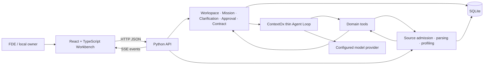

# ContextOx Workbench 架构与迁移报告

> 文档版本：`2026-09-02-approved-2`
>
> 架构状态：`APPROVED — 2026-09-02`
>
> 实现状态：`NEW ARCHITECTURE NOT STARTED`
>
> 自动验证：`HISTORICAL C1 PASS；NEW ARCHITECTURE NOT RUN`
>
> 真实模型验证：`NOT RUN`
>
> 人工产品验收：`HISTORICAL C1 PASS；WORKBENCH PENDING`

## 1. 决策摘要

ContextOx 的第一阶段产品从“本地 TypeScript CLI + Pi Agent Core”调整为“本地 Python 服务 + React/TypeScript Workbench + ContextOx 自有薄 Agent Loop”。首个用户是亲自为客户梳理业务与数据定义的 FDE；CLI 只保留启动、doctor 与必要的自动化入口，不再是主要产品界面。

用户在 Workbench 中创建隔离的客户 Workspace，批量导入明确授权的文档、样例数据、SQL/DDL 与仓库资料。确定性解析器先产生来源版本、结构、样例、基础 profiling 和错误；Agent 只能通过领域工具读取这些证据、搜索已批准 Context、创建澄清、更新结构化定义草案和提交审核。它没有任意文件、Shell、代码或数据库写权限。

证据不能确定业务意图时，Agent 生成专业、结构化、可复制的 ClarificationRequest，由 FDE 找业务负责人、数据中台负责人、数据分析师或技术负责人回答。回答先成为候选；人的批准绑定精确版本和 hash。获批内容被编译为 ContractVersion，并可经再次批准进入新的 WorkspaceContextVersion。模型停止、表单提交和 Approval 都不自动等于 Mission 完成。

V0 使用一个绑定 `127.0.0.1` 的本地 Python 进程提供 HTTP JSON、SSE 和构建后的 React 静态文件。Python 依赖与版本由 UV 管理；Pydantic 模型是 API、事件和表单字段的单一权威，经 OpenAPI/JSON Schema 生成 TypeScript 类型与客户端。SQLite 保存产品状态、来源、批准与收据；DuckDB、实时数据库连接器和重型文档/OCR 组件只在真实样例证明必要时加入。

ContextOx 不建设通用 Memory Service，也不把知识库当作脱离治理的事实仓库。每个 Workspace 维护一份本地私有 `MEMORY.md`，它是已批准 Workspace Context 的简洁、人类可读、版本化投影；Agent 只能提出变更，批准发布后由确定性流程生成。V0 的 Context Selector 先用权限/版本硬过滤和确定性排序，不引入 vector DB、embedding、RAG、后台自动巩固或模型 retrieval gate。

此前 C1 TypeScript CLI 骨架及其自动和人工验收仍是有效历史证据，但它不验证新架构，不得被改写为 Workbench、Python Runtime、真实模型或用户价值通过。

## 2. 目标、范围与成功条件

### 2.1 真实目标

ContextOx 不与 Codex/Claude Code 比拼通用代码能力。它要把企业中分散、含糊和相互冲突的业务认识，编译为可落到字段、指标、映射、规则和验收上的受治理 Contract，并减少 FDE 反复教学、手工整理和跨角色对齐的成本。

V0 必须证明：

- Agent 能从授权证据中区分事实、推断、冲突和未知；
- 它能提出比通用聊天更具体、可回答、能推动责任人的澄清；
- 回答经人裁决后能稳定转成结构化定义，而不是停留在聊天里；
- 获批定义能在后续任务中复用，并保留来源、版本、时效与责任；
- 在同一公开样例上，相比 Codex/Claude Code，能减少关键遗漏、人工改写或对齐时间；
- 所有优势与失败都有可回读证据，不靠 Demo 叙事替代验证。

### 2.2 V0 范围

- 一个本地操作系统用户，固定 `local-owner` 信任边界。
- 一个本地 Python 服务与一个 React/TypeScript SPA；开发期可分进程，交付时由 Python 服务提供构建后的前端。
- 多 Workspace；所有持久对象与对象操作都验证 `workspace_id`。
- 批量导入授权本地文件，或显式绑定一个只读本地文件夹/Git 仓库根；初始精确格式与限制在来源处理 checkpoint 冻结。
- 文档提取、结构化数据 Schema/样例/基础 profiling、SQL/DDL 结构信息。
- 一个薄 Agent Loop、领域工具、SSE 事件、澄清/裁决、Contract 和批准 Context 复用。
- 一个公开电商业务样例与 Codex/Claude Code 基线。

### 2.3 V0 成功条件

`开发路径图.md` 第三节的闭环全部成立，并分别记录：

| 证据层级 | 能证明什么 | 不能替代什么 |
| --- | --- | --- |
| 静态检查 | Schema、生成文件、配置与文档一致 | 运行行为 |
| 自动测试 | 隔离、状态、解析、事件、工具和恢复 | 真实模型表现 |
| Runtime readback | 精确构建能启动并完成受控流程 | 人的使用判断 |
| 真实模型试跑 | 指定模型、输入与预算下的实际行为 | 浏览器人工验收 |
| 人工验收 | 人在指定提交/构建完成任务并记录 PASS | 重复用户价值 |
| 用户价值证据 | 真实 FDE 任务中的节省、复用与错误降低 | 可防御长期 Edge |

较低层 `PASS` 不能推导较高层 `PASS`。

## 3. 已验证事实、被取代决策与假设

### 3.1 当前仓库事实

- 当前仓库 `main` 已包含 C0 文档与 C1 TypeScript CLI scaffold。
- 提交 `8b234eaa6830e66c4217067e1d52997811730a13` 的 C1 自动检查和人工验收已完成；提交 `5af4b6f` 记录其交付状态。
- 当前 runtime dependencies 是 `@earendil-works/pi-agent-core` 与 `@earendil-works/pi-ai` 0.84.4。
- C2 Domain Store、C3 Pi Adapter、真实模型和旧路线的端到端 V0 均未开始或未运行。
- 当前工作树在本提案起草前为 `main...origin/main` 且无未提交改动。

### 3.2 被本决策取代但不删除的历史结论

- TypeScript 作为后端与产品内核语言；
- Pi Agent Core 作为 V0 Agent Runtime；
- CLI-only，浏览器界面延后；
- 先完成完整 Mission/Resume 基础设施，再验证首个用户闭环；
- 只导入单个 Markdown/TXT/JSON 文件。

这些结论从新文档生效后不再指导实现，但历史提交、测试、报告和 Git 记录保留。不得重写历史状态或声称旧 C1 失败。

### 3.3 当前假设

- FDE 愿意在本地 Workbench 中准备客户资料并负责把澄清转交给合适的人；
- 第一阶段不直接接入飞书，也能完成有价值的试点；
- React/TypeScript 的交互收益大于纯 Python UI 的单语言收益；
- Pydantic → OpenAPI/JSON Schema → TypeScript 生成足以防止前后端字段漂移；
- 一个 Provider、串行工具的自有 Loop 足以完成首个闭环；
- SQLite 可覆盖初期产品状态，DuckDB 只在表格规模证明必要时加入；
- 公开电商样例能够暴露真实的身份、粒度、时间、来源、口径冲突和角色裁决问题；
- 与通用 Agent 的差异能在澄清质量、定义完整度、人工修改量和复用上被测量。

这些都是待证伪假设，不作为宣传事实。

## 4. 关键取舍

| 议题 | 当前选择 | 未选择方案 | 原因与回退条件 |
| --- | --- | --- | --- |
| 后端语言 | Python | 全 TypeScript | 数据库、表格、文档生态和主要开发者熟练度更匹配；若本地分发成为不可接受瓶颈再评估 |
| 前端 | React + TypeScript | Streamlit/Gradio、原生 JS、Next.js | Workbench 有上传、表格、事件、表单、Diff 和审批状态；无需 SSR 或云框架 |
| 依赖管理 | UV | pip 手工环境、Poetry | 统一 Python、venv、依赖与 lockfile；精确版本仍需安装门 |
| 接口对齐 | Pydantic 单一来源，生成 TS | 双边手写类型 | 生成和 drift check 比语言统一更能防止字段漂移 |
| Agent loop | ContextOx 薄 Python Loop | Pi Agent Core、复制 Waku、通用框架 | 当前只需一个受限领域 Loop；若 Provider/stream 复杂度超出验证阈值可重新评估 |
| Agent 工具 | 领域专用 allowlist | `read/write/edit/bash` | 缩小权限和动作空间，强制结构化证据与草案更新 |
| 产品入口 | 本地 Web Workbench | CLI-only、云端 SaaS | 文件上传、可视化、澄清与 Diff 需要浏览器；仍保持个人部署 |
| 前后端通信 | HTTP JSON + SSE | WebSocket、进程内 Python UI | V0 事件单向流足够，浏览器提交继续用 HTTP |
| 产品状态 | SQLite | PostgreSQL、队列、工作流引擎 | 单用户单进程足够；保持事务、版本与 fail-closed |
| 分析引擎 | 暂不默认加入 DuckDB | 一开始引入完整数据栈 | 先用真实文件规模证明需要；引入时保持只读和有界 |
| 第一阶段输入 | 授权文件、样例数据、SQL/DDL、仓库资料 | 实时生产数据库连接器 | 降低权限、网络和副作用风险，先验证产品闭环 |
| 澄清交付 | Workbench + 可复制 Markdown/JSON | 自包含 HTML 表单、立即飞书集成 | 对方无需安装；避免第一阶段托管和身份问题 |
| 对标 | Codex/Claude Code | 把 Skill 当产品定位 | 产品必须证明超越通用 Agent 在同一任务上的结果和治理闭环 |

## 5. 系统边界



### 5.1 Python 后端所有

- Pydantic API、事件、表单和 Contract 模型；
- Workspace、SourceRevision、ContextSnapshot、Mission、AgentRun、ClarificationRequest、Decision、ContractVersion、WorkspaceContextVersion；
- 文件准入、解析、profiling、来源引用和失败状态；
- Agent Loop、工具实现、预算、取消、事件归一化和完成判定；
- SQLite schema、事务、审计、迁移、备份和本地数据目录；
- OpenAPI/JSON Schema 输出与前端生成契约。

### 5.2 React/TypeScript 前端所有

- Workspace、来源、任务、运行、澄清、Diff 和审批的用户交互；
- 批量上传、逐文件进度和错误显示；
- SSE 事件消费与运行可视化；
- 使用生成客户端调用 API，不重新定义业务状态或完成语义；
- loading、empty、partial、blocked、failed、cancelled、stale 和 conflict 的可访问呈现。

### 5.3 依赖方向

- Python Pydantic 模型生成 OpenAPI/JSON Schema；前端类型与客户端由生成产物得到。
- 前端不得直接读取 SQLite、客户文件或模型 Provider。
- 解析器和 Store 不导入 React/TypeScript 类型。
- Agent Loop 通过小的模型适配边界调用一个 Provider；Provider SDK 对象不进入持久化 Contract。
- 模型不能绕过领域工具调用解析器、文件系统、数据库或 Store。

## 6. API、事件与字段对齐

### 6.1 单一来源

Pydantic 模型是以下对象的权威定义：

- HTTP request/response；
- SSE event envelope；
- ClarificationRequest/Answer；
- Contract draft/version；
- 用户可见状态与错误；
- 领域工具参数和结果。

生成流程：

```text
Pydantic models
      ↓
OpenAPI / JSON Schema
      ↓
generated TypeScript types + API client
      ↓
frontend typecheck and drift check
```

生成文件带明确注释并禁止手工编辑。CI/本地检查重新生成到临时目录并比较；有差异即失败。数据库 schema 可以与 API Contract 不同，映射只存在于 Python 后端。

### 6.2 最小事件 envelope

每个事件至少包含：

```text
event_id
event_type
occurred_at
workspace_id
mission_id
run_id
sequence
public_payload
```

V0 事件：

- `run_started`；
- `message_created`；
- `model_started`、`model_delta`、`model_completed`；
- `tool_requested`、`tool_started`、`tool_completed`、`tool_failed`；
- `draft_updated`；
- `clarification_requested`；
- `run_completed`、`run_partial`、`run_blocked`、`run_failed`、`run_cancelled`。

SSE 重连必须用 `event_id` 和 `sequence` 去重。`model_delta` 只用于当前连接的实时显示，默认不逐条持久化；持久化的是有界阶段事件、工具收据、终态和明确的最终用户可见输出。重连发生在未完成输出中间时，前端重新读取当前 Run snapshot，不把缺失 delta 伪造成完整文本。隐藏推理、完整 provider payload、密钥和未请求的客户正文不进入事件。

## 7. Agent Loop、工具与终止语义

### 7.1 V0 Loop 边界

- 正式 Run 生命周期：

1. 无正式 Mission 时，系统只能生成 Mission draft；用户确认后才形成正式 Mission，之后才能创建正式 Agent Run；
2. 已有 Mission 时，Run Coordinator 按 `preflight → Context Packet → 模型/串行领域工具循环 → 显式 terminal tool` 编排；
3. 同一 Mission 同时最多一个 active Run；不得并行绕过这一约束；
4. 显式 terminal tools 只有 `create_clarification`、`submit_for_review`、`finish_run`；自然停止、`agent_end` 或普通文本输出都不能替代 terminal result；

Run 组件：

- `Run Coordinator`：检查 Mission 前置条件，编排 Run 生命周期、取消和状态转移；
- `Context Builder/Compiler`：从一致的 ContextSnapshot 生成本轮 provider-neutral ContextPacket；
- `Provider Port`：把 ContextPacket 转换为配置的 Provider-specific request（例如当前 DeepSeek 适配所需的 `messages`），隔离 Provider 请求/响应格式；
- `Tool Registry` 与 `Tool Dispatcher`：维护领域工具 allowlist 并按序校验、执行调用；
- `Terminal Validator`：校验显式终止结果、收据、证据和完成条件；
- `Event/Receipt Recorder`：记录有界公开 Run events 与工具收据，不保存隐藏推理；

- 一个 Run 使用一个 Provider 配置；
- 工具串行执行；
- 每轮要么产生文本、一个或多个按序执行的工具请求，或显式终止；
- 限制 `max_model_turns`、`max_tool_calls`、`max_elapsed_ms` 和可获取时的费用/token；
- 支持用户取消和服务关闭；
- 不支持并行工具、mid-run steering、跨 Run transcript、Agent subdelegation 或通用插件系统；
- 需要人回答时写 ClarificationRequest 并结束当前 Run；回答获准后从持久状态构建新的 Run；
- 正常停止但没有显式业务终止结果时记为 `failed: terminal_result_missing`。

### 7.2 领域工具

| 工具 | 允许行为 | 明确禁止 |
| --- | --- | --- |
| `list_sources` | 列出当前 Snapshot 获准来源及状态 | 枚举任意目录或其他 Workspace |
| `read_source` | 读取已授权 revision 的有界引用片段 | 任意 path、符号链接或未获准正文 |
| `inspect_dataset` | 读取确定性 Schema、样例和 profiling 结果 | 模型生成并执行任意 SQL |
| `search_context` | 搜索已批准且权限匹配的 Context | 把候选、聊天或未批准回答当事实 |
| `create_clarification` | 创建符合 Schema 的澄清候选 | 直接联系外部人员或代表人批准 |
| `update_definition_draft` | 更新结构化草案并保留字段级来源 | 任意文件 edit/write |
| `submit_for_review` | 冻结草案版本/hash 并等待人决定 | 自动批准或完成 Mission |
| `finish_run` | 提交显式终态、收据和证据引用；Domain 重新校验获批 Contract、任务模板与所需证据 | 绕过批准、只凭模型声明成功或把 partial 写成 completed |

第一阶段无 `bash`、通用 `read/write/edit`、代码执行、生产 SQL 执行和外部写工具。未来增加工具必须有具体用户需求、权限边界、失败矩阵、收据与人工批准。

### 7.3 Run 与 Mission 状态

AgentRun：`queued | running | waiting_for_human | partial | completed | blocked | failed | cancelled`。

Mission：`active | waiting_for_human | blocked | completed | cancelled`。

- “active Run”仅指 AgentRun 状态为 `queued | running`；`waiting_for_human` 是已停止执行、等待人回答的状态，不是 active Run；
- `model_completed` 和 `run_completed` 都不自动完成 Mission；
- `agent_end`、Approval 和普通表单提交同样不自动完成 Mission；
- `submit_for_review` 成功使 Run 进入 `waiting_for_human`，Mission 进入同名状态；
- Approval 只发布精确版本并使 Mission 可继续；
- 只有 `finish_run` 的终止结果通过 Terminal Validator，且新 Run 引用获批 Contract、满足任务模板的收据和证据、满足任务完成条件并通过批准的 Mission transition，才能令 Mission `completed`；
- `partial` 是 Run 终态，对应 Mission `blocked`；
- 取消、失败、来源冲突和权限未知不得自动重试或回退到宽松读取。

V0 单进程不预先实现分布式 worker lease。重启恢复依赖 SQLite 中的 Mission/Run/Decision/receipt；启动时发现没有 terminal receipt 的 `running` Run，将其封存为 `failed: interrupted_without_receipt`，Mission 保持 `blocked`，由人显式重试。只有真实并发需求出现后才设计 lease、fencing 和队列。

### 7.4 ContextSnapshot 与 Context Packet

`ContextSnapshot` 是 preflight 锁定的、与 Workspace/Mission 权威状态一致的上下文视图；它不是 Provider 请求，也不是每个 Run 的工作 transcript。
`Context Builder/Compiler` 从 ContextSnapshot、当前 Run 工作集和已选授权证据生成该 Run 的 provider-neutral `ContextPacket`；ContextPacket 是每 Run 的中间表示，可按预算重新编译。
Provider Port 才把 ContextPacket 转换为 DeepSeek `messages` 或其他 Provider-specific request；Provider 对象不进入持久化 Contract、事实层或公开事件。

V0 Context Selector 采用确定性硬过滤和排序：
1. `workspace_id`、权限和有效版本硬过滤；
2. 当前 Mission 的显式引用优先；
3. 已批准的 Contract/Workspace Context 优先；
4. 按实体、字段、指标和业务术语匹配相关候选；
5. 以 recency 作为弱 tie-break；
6. 在 token budget 内裁剪，并把入选与排除原因放入 ContextPacketManifest。

Context 优先级为：

```text
P0 产品/权限/工具/终止规则
P1 当前 Mission 权威状态
P2 已批准 Workspace Context
P3 本 Run 工作集
P4 授权相关证据
P5 派生 continuation summary
```

上下文超限时依次丢弃 UI-only/重复事件和已完成 deltas，把大工具输出转换为有界 summary 与 receipt refs，结构化压缩旧消息并保留近期完整消息，最后降低相关证据。
绝不截断当前用户消息、Mission 目标/完成条件、权限、未解决澄清、当前 draft version、approval/contract hashes 或活动 tool-call/result pair。仍超限则 Run 进入 `blocked`，原因是 `context_budget_exceeded`。

## 8. 来源、数据与文档处理

### 8.1 来源准入

每次导入创建不可变 SourceRevision，至少记录：

```text
workspace_id
source_id
revision_id
original_name
media_type
byte_size
sha256
observed_at
optional effective_time
permission_status
parse_status
parser_version
```

上传文件先落入 Workspace 专用私有数据目录，再由类型路由器处理。批量上传允许部分成功，但整体响应必须逐文件区分 `accepted | partial | blocked | failed`。

本地文件夹/Git 绑定是另一种来源：用户必须显式提交规范化根路径并确认只读授权；后端记录根路径身份与当次 snapshot/hash，只允许解析根内 regular files。父目录、路径穿越、根外 symlink 目标、Git hooks、子进程和代码执行全部拒绝。一个绑定只能属于一个 Workspace；跨 Workspace 复用必须重新显式授权。

### 8.2 V0 处理层级

- 文档：提取可引用文本、标题/段落等可恢复结构；
- CSV/JSON/XLSX：表/Sheet、字段、类型、样例、缺失、唯一性、重复和基础数值/类别摘要；
- SQL/DDL：方言声明、表/字段/约束/注释等静态结构；解析失败保留原始错误；
- Git/代码仓库：V0 只读取用户明确绑定的规范化根或导入快照，并通过受限来源读取；可读取 tracked 文件清单与明确允许的文本文件，不运行 Git hooks、代码或子进程，不遍历未获准路径；
- PDF/DOCX：是否进入首个格式 allowlist 由公开 fixture 与解析质量决定；OCR、扫描件和复杂版面不是默认承诺。

解析和 profiling 是确定性程序，不由模型任意生成代码执行。模型只看到完成当前任务所需的有界摘要和引用片段。

### 8.3 数据库远期边界

实时数据库连接器不是 V0。进入连接器阶段前必须冻结：

- 凭证保存与轮换；
- 网络边界和部署位置；
- 元数据、样例行、profiling 与查询历史的独立权限；
- 行列级权限、脱敏和读取预算；
- 只读查询 allowlist、超时、成本与审计；
- 数据新鲜度和 source revision 身份；
- 未知查询结果与重试语义。

即使未来接入数据库，模型也不直接持有凭证或任意 SQL 工具；确定性连接器编译并执行获准操作。

## 9. 澄清、裁决与经验内化

### 9.1 ClarificationRequest

每个澄清至少包含：

```text
question
why_needed
expected_answer_type
suggested_owner_role
related_definition_paths
evidence_requested
examples_or_options
blocking_impact
source_refs
status
```

表单面向懂业务或数据的负责人，不故意降成小白问卷；同时避免开放式长文成为唯一输入。能用枚举、范围、日期、字段选择、正反例或证据链接表达时，优先提供结构化回答方式，并保留必要的说明字段。

V0 支持 Workbench 内填写和复制/导出 Markdown/JSON 澄清包。导出文件不是认证或批准载体；重新导入回答时必须由本地 FDE 声明回答者/来源并确认内容。

### 9.2 Approval 与内化

ApprovalRequest 冻结 `workspace_id`、目标对象、版本、canonical payload、SHA-256 和 `required_actor=local-owner`。Decision 必须重复提交版本和 hash；旧版本、错误 hash、跨 Workspace、已失效 request 和冲突 replay 关闭失败。相同决定重放返回既有结果，不产生第二份副作用。

回答与 Agent 草案都先是候选：

```text
AnswerCandidate
      ↓ local human decision
ContractVersion
      ↓ explicit context publication decision
WorkspaceContextVersion
```

只有已批准 WorkspaceContextVersion 可被后续 Mission 的 `search_context` 使用。原答案、裁决、Contract 与 Context 版本保持可追溯，发布新版本不修改旧版本。

来源授权与业务事实批准始终分离：来源授权只说明该 Workspace 可以读取某个 SourceRevision，不代表其中的业务定义或结论已经被批准。

同一 Workspace 内仍有效且已授权的 SourceRevision，可以在后续 Mission 中自动检索并作为证据使用，无需重复批准来源；已发布且未变化的 WorkspaceContextVersion 按其版本自动复用。聊天记录、未批准澄清和 Agent 推断即使被显式带入其他 Mission，也始终是 candidate，不能因此升级为事实。业务定义、规则、映射或适用范围发生实质变化时，必须重新形成版本并重新批准。

### 9.3 Workspace `MEMORY.md`

每个 Workspace 维护一份本地私有 `MEMORY.md`，概念路径为：

```text
<contextox-data>/workspaces/<workspace_id>/MEMORY.md
```

它是已批准 Workspace Context 的简洁、人类可读、版本化投影，不是事实源、独立 Memory Service 或独立检索层；权威仍是带批准、版本、hash 和来源追溯的 WorkspaceContextVersion/Contract。
加载前必须先检查文件 hash 与对应批准版本；hash 匹配时，`MEMORY.md` 可以作为已批准 Context 的可读投影参与加载，但不能提升或改变事实等级；hash 失配时 Run 不读取该文件。
Context Builder 必须能够从权威 WorkspaceContextVersion 直接重建所需上下文，不能依赖 `MEMORY.md` 文件可用。

批准发布触发确定性生成；Agent 只能提交候选 diff，不能直接把聊天、澄清或推断升级为事实。手工修改导致 hash 不一致时标记为 `stale/conflict`。
投影生成失败或进程崩溃时，WorkspaceContextVersion 的批准不回滚；`MEMORY.md` 标记为 `stale/failed_projection`，Run 不读取失配或失败文件，并可从权威版本重建，概念上以原子替换发布成功投影。

`MEMORY.md` 不进 Git，也不包含聊天记录、隐藏推理、未批准推断、原始大资料、工具日志、Provider payload 或 secret。
## 10. 持久化、隐私与失败语义

### 10.1 SQLite 最小责任

候选表：`workspaces`、`source_bindings`、`source_revisions`、`source_artifacts`、`missions`、`agent_runs`、`mission_messages`、`public_run_events`、`context_packet_manifests`、`run_continuation_summaries`、`clarification_requests`、`clarification_answers`、`approval_requests`、`decisions`、`contract_versions`、`workspace_context_versions`、`context_version_sources`、`tool_receipts`、`audit_events`。`public_run_events` 不逐条保存 `model_delta`。

不是所有表在 scaffold 一次创建；每个 checkpoint 只加入当前行为需要的 schema。所有跨对象关系携带 `workspace_id` 并用数据库约束和 Store 查询共同验证。

`MissionMessage` 只保存用户消息与 Agent 最终回复；`ContextPacketManifest` 只记录对象 ID、版本/hash、预算和排除原因，不保存完整私有 prompt。
`RunContinuationSummary` 是派生的非事实摘要，绑定精确消息范围、产生它的 `ContextPacketManifest` 以及 Mission、SourceRevision、WorkspaceContext、Contract 的 input versions/hashes；相关输入变化时失效并可重建。
Provider working transcript 只在每个 Run 内临时存在；公开的有界 Run events 持久化，隐藏推理不持久化。

### 10.2 失败矩阵

| 场景 | 状态 | 自动行为 |
| --- | --- | --- |
| 文件部分解析失败 | Source `partial` | 保留成功部分与错误；不得写 `verified` |
| 不支持/损坏/超限文件 | Source `blocked/failed` | 不调用模型猜测内容 |
| Workspace/对象不匹配 | `blocked` | 不返回数据；写有界审计 |
| 权限未知、撤销或来源冲突 | `blocked` | 不自动选边或放宽读取 |
| Provider 缺凭证/超时/中断 | Run `blocked/failed` | 不打印密钥；不自动重试 |
| 工具参数畸形 | Run `failed` | 不执行工具 |
| 未授权工具 | Run/Mission `blocked` | `capability_denied` |
| 无显式终止结果 | Run `failed`，Mission `blocked` | `terminal_result_missing` |
| 服务在 Run 中崩溃 | 旧 Run `failed`，Mission `blocked` | 启动 readback 后由人显式重试 |
| 旧版本/hash 决策 | `conflict` | 不写 Decision |
| 重复相同决定 | 原结果 | 幂等 readback |
| Agent 产出不完整 | Run `partial`，Mission `blocked` | 不提升为 completed |
| Context 编译在预算内仍无法保留受保护内容 | Run `blocked` | `context_budget_exceeded`；不截断受保护内容、不降级权限 |
| `MEMORY.md` 投影生成失败或进程崩溃 | WorkspaceContextVersion 仍已批准；`MEMORY.md` `stale/failed_projection` | 不回滚批准；Run 不读取失配/失败文件；从权威版本重建并概念上原子替换 |
| `MEMORY.md` hash 失配 | `MEMORY.md` `stale/conflict`；WorkspaceContextVersion 保持已批准 | 加载前检查；不读取失配文件；从权威版本重建 |
| 用户取消 | Run/Mission `cancelled` | 事务后尽力取消 Provider；不写成功 |
| 外部副作用未知 | `needs_reconciliation`（未来） | 禁止自动重试；V0 没有此类工具 |

### 10.3 隐私与日志

- 客户源文件、SQLite、凭证、原始 provider payload、完整 transcript 和私有评测数据在 Git 外；
- 模型只接收当前 Mission 所需、有权限的片段和数据摘要；
- 默认日志只含 IDs、状态、时间、计数、hash 和有界错误；
- public_run_events 不含隐藏推理、密钥、完整原文或其他 Workspace 内容；
- 前端下载/复制前显示其范围；删除 Workspace、源文件或审计是独立破坏性操作并需备份/确认；
- 本地服务默认只监听 `127.0.0.1`，不因开发方便开放到局域网。

## 11. Workbench 信息架构与可访问性

### 11.1 V0 页面/区域

- Workspace：客户 Workspace 创建、切换与隔离状态；
- Sources：批量上传、逐文件状态、文档/表格/DDL 预览与来源版本；
- Mission Workbench：右侧任务对话，左侧阶段/工具/证据/状态，可调整但不要求复杂画布；
- Clarifications：待回答、已回答、冲突与阻塞影响；
- Contract：结构化定义、字段级来源、版本 Diff、审批与导出；
- Run details：模型、预算、时间、工具收据、公开事件和终态。

### 11.2 浏览器人工验收门

只有人可以为精确提交/构建记录 PASS。清单必须记录：

- branch、commit、Python/Node/lockfile hash、启动命令和数据目录；
- 一个可复用浏览器 tab，默认 URL、桌面 viewport、窄屏 viewport、100% zoom；
- 从空 Workspace 开始的测试数据和 reset 方法；
- 拖拽与文件选择批量上传，混合成功/失败、重复、超限和取消；
- 鼠标、键盘、Tab 顺序、焦点、滚动、弹窗返回焦点和可见 focus；
- loading、empty、partial、blocked、failed、cancelled、stale、conflict 和断线重连；
- SSE 重连无重复事件，刷新页面可 readback；
- 表格、长文、长 ID、Diff 和错误在目标 viewport 可读；
- 浏览器 console/network 无未解释错误；
- 右侧对话与左侧流程状态一致，不显示隐藏推理；
- 测试结束只清理专用临时数据目录并记录 PASS/FAIL 笔记。

## 12. 仓库与实现迁移

### 12.1 目标结构（候选）

```text
contextox-agent/
├── pyproject.toml
├── uv.lock
├── .python-version
├── README.md
├── 开发路径图.md
├── docs/
│   ├── 架构与迁移报告.md
│   └── migration-publication-manifest.json
├── src/contextox/
│   ├── api/
│   ├── contracts/
│   ├── agent/
│   ├── sources/
│   ├── domain/
│   ├── store/
│   └── cli.py
├── tests/
├── web/
│   ├── package.json
│   ├── package-lock.json
│   ├── src/
│   │   ├── api/generated/
│   │   ├── components/
│   │   └── features/
│   └── dist/
└── fixtures/
```

目录是边界建议，不授权一次性创建，也不要求为每一概念建立单独模块。依赖与具体框架只有在 checkpoint 的精确 manifest/lockfile 审查后才能安装。

### 12.2 迁移顺序

1. 精确批准并写入本报告、README 和开发路径图；
2. 在短期 `codex/` 分支增加 Python/UV 与最小 Web scaffold，不修改 C1 历史；
3. 生成并验证 Python → TypeScript Contract；
4. 通过 Python tests、前端 typecheck/test/build 和本地 Browser smoke；
5. 再以独立提交删除或移动被取代的 `src/*.ts`、`test/*.ts`、旧 Node config 和 Pi runtime dependencies；
6. 对删除后的完整 diff、lockfiles、licenses、scripts 和安装产物重新验证；
7. 经人验收后合并到最新 `main`；是否 push 由当次计划授权。

删除旧 C1 文件前的回滚边界是迁移分支起点；删除后仍可通过 Git 历史恢复，不使用破坏性 reset。任何与用户未提交改动重叠时停止。

### 12.3 依赖门

候选能力类别，而非已批准精确包：

- Python API/ASGI 与本地 server；
- Pydantic 与 OpenAPI；
- 模型 Provider SDK；
- 文档/表格解析；
- React、TypeScript、Vite 与测试工具。

每个 direct dependency 在安装前记录精确版本、license、release notes、Python/Node engine、生命周期/构建脚本和 lockfile diff。使用 `uv sync` 与前端的 lockfile 安装模式；不运行未经审查的生命周期脚本。DuckDB、ORM、任务队列、向量库、OCR、MCP、UI 大框架和 Agent framework 默认不加入。

## 13. 分阶段实现与验证

| checkpoint | 只包含 | 自动验证 | 人 Gate |
| --- | --- | --- | --- |
| N0 新文档基线 | 三份精确文档 | links、状态与旧决策残余检查 | 精确文本批准 |
| N1 Python/Web scaffold | UV/Python API + React/TS + generated contract + doctor | clean sync、Python tests、TS typecheck/test/build、schema drift、outside smoke | 依赖与 Browser shell |
| N2 Source admission | Workspace、批量上传、解析、预览、profiling | 格式/大小/损坏/partial/隔离/日志测试 | 真实公开文件上传体验 |
| N3 Thin Agent Loop | 单 Provider、领域工具、SSE、预算/取消 | fake model、tool validation、event order、reconnect、terminal tests | runtime contract；真实模型另授权 |
| N4 Clarification/Contract | 表单、回答、审批、Diff、Context 内化 | version/hash、冲突、重放、恢复、跨任务复用 | 业务/数据负责人可理解性 |
| N5 Demo/baseline | 公开电商样例、完整闭环、Codex/Claude 基线 | fixture/eval 可复现 | 真实模型 + 浏览器 + 对比结论 |
| N6 FDE pilot | 已授权真实场景与度量 | 隐私、删除、收据 readback | 用户价值 Decision Gate |
| N7 Feishu decision | 只读导入/表单候选设计 | API/权限/失败 fixture | 新架构与外部写授权 |

每个 checkpoint 开始前重新说明文件、依赖、外部作用、验证、回滚与不做项，并等待确认。

## 14. 公开样例与基线评测

公开样例必须同时包含：

- 业务目标与决策场景；
- 文档中的自然语言口径；
- CSV/XLSX 样例数据；
- SQL/DDL 或 Schema；
- 身份、粒度、时间、空值、例外和迟到数据问题；
- 至少两处证据冲突或缺口；
- 不同角色能回答的问题与结构化回答；
- held-out 的关键遗漏和反例，仅供评测，不可被 Agent 工具读取。

ContextOx 与 Codex/Claude Code 使用同一可见材料、目标、时间和模型预算。记录：

- Contract 必填维度覆盖率；
- unsupported claim 与事实错误；
- 提出的澄清中，必要/可回答/路由正确的比例；
- 人工增加、删除和改写字段；
- 到批准 Contract 的总时间与交互轮次；
- 第二个 Mission 使用已批准 Context 后的复用收益；
- 模型、token、费用和失败状态。

评测材料、产品运行和人的价值判断保持独立。静态 fixture PASS 不代表 Agent、真实模型、浏览器或用户价值 PASS。

## 15. 远期数据库、文档与飞书方向

Python 后端为未来数据库和文档处理提供生态基础，但本报告不承诺提前建设连接器平台。扩展顺序由真实瓶颈触发：

1. 增加已证明需要的文件格式或解析质量；
2. 对较大结构化文件引入受控 DuckDB/Arrow/Polars 等能力；
3. 只读数据库元数据/Schema 连接器；
4. 有单独权限的样例/profiling/查询历史；
5. 飞书文档/多维表格只读导入；
6. 经身份、回调、幂等和外部副作用设计后的澄清发送/回收；
7. 多用户、云部署或组织权限只有重复客户需求出现后再决策。

每项新增能力都必须明确数据如何获得、谁授权、保留多久、失败如何表示、是否可重试以及如何删除；不能以“远期需要”作为当前依赖或抽象的充分理由。

## 16. 未解决风险与 Decision Gates

| 事项 | 当前状态 | 决策时点 |
| --- | --- | --- |
| 首个 Python minor 与操作系统支持 | 未冻结 | N1 manifest 前 |
| Python API/server 精确框架 | 候选待审 | N1 dependency gate |
| 首个模型 Provider/SDK | 未决定 | N3 前 |
| 前端测试与组件依赖 | 未决定 | N1 manifest 前 |
| 首批文件格式、大小、Sheet/行列限制 | 未冻结 | N2 fixture 后 |
| PDF/DOCX 是否进入 V0 | 未决定 | N2 解析质量证据 |
| DuckDB 是否需要 | 无性能证据 | N2/N5 实际规模 |
| ClarificationRequest 精确字段与必填规则 | 本报告为最小候选 | N4 前展示精确 Schema |
| Contract 精确 Schema | 未冻结 | N4 前 |
| 公开电商样例权利与脱敏 | 未批准 | 复制/创建 fixture 前 |
| ContextOx 相比 Codex/Claude 的增益 | `NOT VERIFIED` | N5 Decision Gate |
| Context Selector 未来升级 | 无证据/未批准 | 仅当真实 held-out Mission 证明所需证据存在、但确定性选择在 token budget 内经常漏召回时另行决策；先评估 SQLite FTS/BM25，再考虑 embedding，不自动授权 Memory Service、向量库、RAG 或后台巩固 |
| 飞书集成 | 候选，不承诺 | N6 出现重复瓶颈后 |
| 实时数据库连接器 | 候选，不承诺 | 真实试点授权后 |
| 旧 TypeScript 文件删除 | 未授权 | N1 新 scaffold 验证后精确 diff |
| commit、push、release、deploy | 未授权 | 各 checkpoint 单独计划 |

## 17. 批准记录与持续执行边界

2026-09-02，人已在讨论中确认：Python 后端与 UV、React + TypeScript Workbench、Pydantic/Schema 字段对齐、自有薄 Agent Loop、领域专用工具、批量上传、流程/工具可视化、专业澄清表单、批准经验内化，以及飞书作为第二阶段候选。

同日进一步确认：Agent Run 的 Mission draft/正式 Run 边界、preflight 与 provider-neutral Context Packet、串行领域工具与显式 terminal tools、Run/Mission 完成和失败语义、ContextSnapshot 与 per-Run ContextPacket 的关系、跨 Mission 的授权来源与批准 Context 复用、确定性 Context Selector，以及每个 Workspace 的私有 `MEMORY.md` 生成、加载前 hash 检查、版本失效和 stale/conflict/failed_projection 边界。

本报告、README 和开发路径图的精确文本只有在人审阅并再次明确批准后才能写入仓库。写入批准不自动授权代码迁移、文件删除、依赖安装、lockfile 变更、分支、提交、push、真实模型、客户数据、外部 API、发布或部署。

新架构生效后，历史 C1 仍保持其原证据等级；新架构的实现、自动验证、真实模型、浏览器验收与用户价值从 `NOT STARTED/NOT RUN/PENDING/NOT VERIFIED` 开始，不能继承旧 PASS。

## 18. 来源证据

- [Waku README](https://github.com/ShenSeanChen/waku-agent)：Python 自有 Loop、本地 Dashboard、领域工具与 plain static frontend。
- [Waku Agent Loop](https://github.com/ShenSeanChen/waku-agent/blob/main/waku/loop/agent.py)：可读的 reason-act-observe 循环参考；ContextOx 不复制其代码。
- [Waku static frontend](https://github.com/ShenSeanChen/waku-agent/tree/main/waku/ops/static)：HTML/CSS/JavaScript、无构建步骤的 Dashboard 实现参考。
- [Pi Agent Core](https://github.com/earendil-works/pi/tree/main/packages/agent)：已评估但被新决策取代的通用 Agent Runtime 方案。
- [Pi Coding Agent](https://github.com/earendil-works/pi/tree/main/packages/coding-agent)：`read/write/edit/bash` 属于编码 Agent 产品边界，不是 ContextOx 默认工具面。
- 仓库历史提交 `8b234eaa6830e66c4217067e1d52997811730a13` 与 `5af4b6f`：旧 C1 实现和状态证据。
