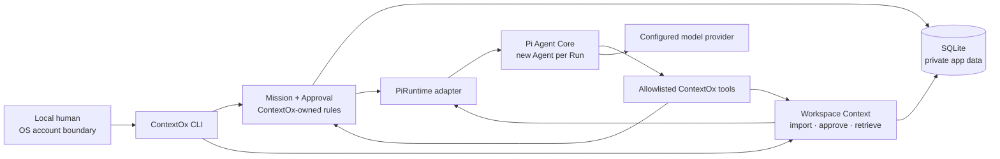

# ContextOx Agent 架构与迁移报告

> 文档版本：`2026-09-01-approved-1`
>
> 架构状态：`APPROVED — 2026-09-01`
>
> 实现状态：`NOT STARTED`
>
> 自动验证：`NOT RUN`
>
> 真实模型验证：`NOT RUN`
>
> 人工产品验收：`PENDING`

## 1. 决策摘要

建立独立的公开仓库 `contextox-agent`，使用 TypeScript 编写一个 ContextOx 自有的产品内核，并把发布版 Pi Agent Core 当作普通依赖。新项目不 fork Pi、不复制 Pi 或 Waku 的 Agent loop，也不迁移 Pi Coding Agent/TUI。

V0 采用本地单用户 CLI、多个相互隔离的公司 Workspace、SQLite 持久化和单 Mission 闭环。Agent Run 每次新建、运行期记忆临时；Mission、审批、任务工件和受治理的 Workspace Context 持久。公司知识不是人物记忆：它必须来源可追溯、版本化、受权限约束并经人批准。

当前最小产品任务是帮助 FDE/工程师把授权公司资料整理为可审批、可恢复、可验收的业务定义 Contract。暂不建设 Web、多用户认证、跨任务个人记忆、向量数据库、知识图谱、MCP Memory 服务或分布式工作流。

## 2. 目标、范围与成功条件

### 2.1 真实目标

目标不是“把旧仓库变小”，而是把产品所有权从 Pi fork 中分离出来：

- Pi 上游可以正常升级，而 ContextOx 不维护一条 Pi 源码分叉线；
- 产品状态和完成语义不依赖一次模型会话是否结束；
- Agent 只能使用当前 Workspace、当前 Snapshot 和当前 Mission 明确授权的知识与工具；
- 人的批准绑定不可变对象，而不是一句聊天文字；
- 失败、重试、未知副作用、来源过期和权限缺口都能被诚实表示；
- 公共代码与私有客户数据物理分离；
- 首个真实任务闭环形成后，再用证据决定哪些能力值得扩展或私有化。

### 2.2 V0 范围

- 本地 CLI；一个操作系统用户，固定本地 actor。
- 多 Workspace，所有持久对象显式包含 `workspace_id`。
- 用户显式导入 UTF-8 Markdown、纯文本和 JSON。
- Agent 起草 Company Brief；人批准后成为 Workspace Context 版本。
- Mission 冻结一个不可变 Context Snapshot。
- Pi Agent Core 执行模型—工具循环；ContextOx 控制工具、预算、持久化、审批与完成。
- 首个 Contract 任务、确定性 fixture、真实模型试跑与人工验收。

### 2.3 V0 成功条件

`开发路径图.md` 第三节的十二项闭环全部成立，并且结果按以下层级分别记录：

| 层级 | 可证明的内容 | 不可替代的下一层 |
| --- | --- | --- |
| 静态材料检查 | 文件、manifest、哈希、结构存在 | 运行期行为 |
| 自动化测试 | 状态机、隔离、幂等、适配器行为 | 真实模型表现 |
| 真实模型试跑 | 指定模型在指定输入上的实际输出 | 人工产品判断 |
| 人工验收 | 人在指定提交上记录的任务结果 | 重复用户价值 |
| 用户价值证据 | 真实任务中的复用、节省与错误降低 | 可防御 Edge |

任何较低层的 `PASS` 都不得推导出较高层的 `PASS`。

## 3. 已验证事实与显式假设

### 3.1 当前仓库事实

- 新仓库在本决策开始时已初始化为 `main`，无提交、无 remote，除 `.git` 外无文件。2026-09-01 获批后，仅两份批准文档被写入并逐字节核对；代码、依赖、lockfile、提交与 remote 仍未创建。
- 旧仓库基线提交为 `f84c1face877aed443ccfec180959ff193f62348`，当前工作树干净。
- 旧仓库有 1,536 个 tracked files；`.git` 当前约 79.8 MiB。
- 旧 `packages/contextox` 有 14 个 tracked files、约 2,311 行 TS/JS；它依赖 Pi Coding Agent、Pi TUI 和 Pi AI 0.84.3。
- 旧 `packages/semantic-agent` 有 41 个 tracked files、约 14,654 行 TS/JS；它实现了一套比当前 V0 更广的通用契约、计划、运行 Host、Context Pack、Binding 和 Tool Registry。
- 其他旧 packages 约 266,423 行 TS/JS，主要属于 Pi monorepo，不是 ContextOx 产品资产。

### 3.2 上游事实（核对日期：2026-09-01）

- 固定证据 `v0.84.4`（解析到提交 `b79e4cc834970cca69daebffab7df1da7d1e52c4`）中的 Pi Agent Core manifest 版本为 0.84.4，要求 Node `>=22.19.0`，仓库许可证为 MIT；`main` 只作为 2026-09-01 的观察，不作为可复现依赖证据。
- Pi Agent Core 公共 API 提供 `Agent`、事件订阅、工具执行、取消、`beforeToolCall`、`afterToolCall` 和 turn stop hook；这足够承载 V0 的模型—工具循环。
- Pi Agent Core README 的 Quick Start 直接依赖 Pi AI 选择模型和 stream function，因此 V0 候选运行依赖是同版本的 `@earendil-works/pi-agent-core` 与 `@earendil-works/pi-ai`。
- Node 22.18 起默认启用 TypeScript type stripping；Node 22 文档要求仅使用可擦除语法，并明确 Node 不执行 `node_modules` 下的 TypeScript。因此开发期可以直接运行 `.ts`，发布物必须编译成 JavaScript。
- Node 22 当前文档包含 `.test.ts` 测试模式；Node 标准库提供 `node:sqlite`。当前本机 Node 24.20.0 已只读验证 TypeScript test、emit、`node:sqlite`、FTS5，以及候选 `scripts/test.mjs` 的“一项测试通过/零文件退出 1”正反探针；最低目标 Node 22.19 尚未实际运行。C1 必须在 22.19 clean environment 重做显式 glob、非零 test count 和同一 SQLite/FTS5 自检。
- Waku 是 Python 实现的本地个人助手。其 README 明确把 SQLite/FTS5 的 semantic、episodic、procedural memory 当作核心；这些本地 memory 代码是公开的。远程 Waku Memory 通过 MCP 是可选连接方式，不是本地 memory 的默认实现。
- Waku 的 loop 是直接围绕 Anthropic 风格接口手写的 Python loop，并非 Pi 内核。其个人记忆 retrieval gate 在错误时 fail open；该策略不能直接用于受治理的公司业务上下文。

### 3.3 当前假设

以下内容尚未由真实用户或实现证明：

- FDE/工程师愿意从本地 CLI 和单任务 Contract 场景开始使用；
- Company Brief 足以成为 V0 的高价值上下文形式；
- FTS5 在 V0 数据量与中文/英文混合文本上足够；
- 单进程 CLI 加 SQLite 能覆盖初期并发；
- 0.84.4 是执行依赖安装时仍应选用的 Pi 发布版本；
- “高潜客户定义”是合适的首个公开示例，而不是唯一产品方向。

这些假设进入验证清单，不作为事实写入产品宣传。

## 4. 关键取舍与被拒绝方案

| 议题 | 选择 | 被拒绝方案 | 决定性原因 |
| --- | --- | --- | --- |
| Pi 复用 | 精确版本 npm 依赖 + lockfile | fork、vendor、复制源码、Git dependency | 减少上游同步责任，保持 ContextOx 所有权边界 |
| Runtime 层级 | Pi Agent Core | Pi Coding Agent/TUI | 后者携带通用编码产品资源、会话和 UI 语义 |
| Agent loop | 使用 Pi 公共 API | 复制 Waku/Pi loop | 重复维护，且 Waku 是不同语言与不同 provider 形状 |
| 项目形态 | 单 package CLI | monorepo、多服务 | 当前只有一个产品和一个部署单元 |
| 任务连续性 | 持久 Mission + 新 Run 恢复 | 持久 Pi chat session | 恢复需要业务状态，不需要跨任务人物记忆 |
| 公司知识 | 受治理 Workspace Context | 自动从聊天写个人 memory | 公司事实需要来源、版本、权限与人工发布 |
| 检索 | 确定性过滤 + SQLite FTS5 | 向量库、知识图谱 | 当前没有证明语义召回复杂度必要 |
| Context 服务 | 进程内模块 | 独立 MCP 服务 | 当前只有一个 Agent Host；远程协议没有收益 |
| 工作流 | SQLite resume job | Temporal、DBOS、队列 | 单机 V0 可用事务、lease 和幂等键解决 |
| 身份 | OS 用户信任边界 + 固定 `local-owner` | 任意 `--actor`、先做 SSO | CLI 参数不是身份；当前也没有多用户需求 |
| 开源 | 单一 MIT 公共仓库 | 立即拆 public/private repos | 目前没有已证明且可隔离的 Edge |
| 测试 | `node:test` + fake stream | Vitest 与完整框架 | Node 标准库足够覆盖当前逻辑 |
| TypeScript 运行 | 源码直跑、发布前 `tsc` | `tsx` 或发布 `.ts` | 少一个依赖，同时兼容 Node 对 node_modules 的限制 |

## 5. 系统边界



### 5.1 ContextOx 所有

- Workspace、SourceRevision、WorkspaceContextVersion、ContextSnapshot。
- Mission、AgentRun、ApprovalRequest、Decision、ContractVersion、ResumeJob。
- 任务模板、系统提示、能力集合、工具实现与副作用策略。
- 证据引用、状态机、完成判定、审计与 CLI 契约。
- 数据位置、迁移、清理、权限与用户可见状态。

### 5.2 Pi 上游所有

- LLM message/tool loop、模型 stream 协议、运行事件和取消。
- 公共 `Agent` API 及其内部实现。

### 5.3 允许的依赖方向

- `domain.ts`、`store.ts`、`context.ts` 不导入 Pi。
- 只有 `pi-runtime.ts` 直接实例化 Pi `Agent`。
- `tools.ts` 提供 ContextOx 工具行为；Pi schema/adapter 细节限制在 `tools.ts` 与 `pi-runtime.ts`。
- CLI 只调用 ContextOx 应用函数，不直接操作 Pi state。
- Pi 事件只经归一化后进入持久化；Pi message object 不成为数据库契约。

## 6. 记忆与上下文模型

### 6.1 四层状态

| 层 | 生命周期 | 内容 | V0 是否存在 |
| --- | --- | --- | --- |
| Workspace Context | 跨 Mission | 批准的公司简介、术语、来源与规则 | 是 |
| Mission State | 单任务跨进程 | 目标、Snapshot、提案、决定、工件、恢复作业 | 是 |
| Agent Working Memory | 单 Agent Run | 本次提示、检索片段、模型消息、工具结果 | 是，Run 后释放 |
| Personal/Episodic Memory | 跨任务人物与聊天 | 偏好、关系、历史对话 | 否，推迟 |

### 6.2 Workspace Context 建立流程

1. 用户创建 Workspace。
2. 用户显式导入受支持文件；程序拒绝目录、符号链接、超限文件、未知编码和不支持格式。
3. 每次导入创建不可变 `SourceRevision`：`workspace_id`、source ID、revision ID、media type、bytes、SHA-256、`observed_at`、可选 effective time、权限状态与正文。
4. 文本被确定性切块并写入 FTS5；每个 chunk 保留 source revision 与 chunk hash。
5. 用户创建一种专用的 Context-draft Mission 并启动 Run；Agent 只能读取明确选中的 SourceRevision。它与业务 Mission 使用同一 Mission/Run/Approval 状态机，因此每个 ApprovalRequest 都有 `mission_id`，不另造一套审批语义。
6. Agent 生成带逐项引用的 Company Brief draft，并列出冲突、未知和过期项。
7. 人针对 draft 版本与哈希作出决定。
8. 批准创建不可变 `WorkspaceContextVersion`；拒绝不发布；要求修改创建恢复作业。
9. 新 Mission 创建时从一个已批准版本生成 `ContextSnapshot`，冻结 source revisions、brief version、检索策略版本和整体 hash。
10. Mission 中的新发现只能写为 `KnowledgeCandidate`；批准候选会产生新的 WorkspaceContextVersion，不会改变既有 Snapshot。

### 6.3 检索契约

检索请求必须包含：

```text
workspace_id
context_snapshot_id
mission_id
query
requested_kinds
limit
```

处理顺序固定：

1. 验证 Mission 属于 Workspace，且绑定该 Snapshot。
2. 从 Snapshot 读取允许的 source revisions；禁止调用方提交任意 source IDs 绕过。
3. 验证 source 权限与状态。
4. 对允许的 chunks 执行 FTS5 查询。
5. 返回有界结果：正文片段、source/revision/chunk IDs、hash、`observed_at`、effective time、freshness/status。

默认规则：

- `draft`、`revoked`、权限未知或不匹配：不返回并阻塞依赖它的任务。
- `conflict`：返回冲突摘要供澄清，但不得作为单一 verified 事实。
- `stale` 或 freshness `unknown`：可被看到，但不能独立支撑 verified 结论；V0 需要更新来源后显式 retry/reopen，不提供 freshness 例外审批。
- 零结果：返回 `not_found`，不让模型把缺失解释为否定事实。
- 任何数据库/FTS 错误：返回 `blocked`，不退化为跨 Workspace 扫描或全量 prompt 注入。

## 7. Mission、审批与完成语义

### 7.1 Mission 状态

| 当前状态 | 事件 | 下一状态 | 持久副作用 |
| --- | --- | --- | --- |
| 无 | create | `active` | 绑定 Workspace 与 ContextSnapshot |
| `active` | approval requested | `waiting_for_human` | 写冻结 payload、版本、hash |
| `active` | explicit success result | `completed` | 引用已批准 ContractVersion，写完成 receipt 与 evidence |
| `active` | runtime/policy/provider/tool failure | `blocked` | Run/ResumeJob 写失败原文与“是否可安全人工重试”；V0 不自动重试 |
| `waiting_for_human` | approve | `active` | Decision、ContractVersion、ResumeJob 同事务创建 |
| `waiting_for_human` | request changes | `active` | Decision、ResumeJob 同事务创建，不发布 Contract |
| `waiting_for_human` | reject | `blocked` | Decision；不创建 ResumeJob |
| `blocked` | explicit retry/reopen | `active` | 写 actor、原因与新 ResumeJob/Run |
| 非终态 | cancel | `cancelled` | 同事务取消 pending/leased job 与 pending Approval，令运行中 Run `cancelled`、写 cancel terminal receipt 并失效其 fence；提交后发 AbortSignal |
| `completed`/`cancelled` | 任意运行事件 | 不变 | 拒绝状态回退 |

`blocked` 是需要人处理的暂停状态，不伪装成成功；`completed` 和 `cancelled` 是终态。

每个 Mission 有单调递增 `state_version`。`request_human_approval`、`finish_mission`、retry/reopen 和 cancel 的持久转换都在事务中执行条件更新：`WHERE workspace_id = ? AND id = ? AND status = <expected> AND state_version = <expected>`。只有更新一行的事务可以写对应 Approval、completion receipt 或 cancel 事件；失败者回读赢家并返回 conflict/terminal 状态。

cancel 使用一个 `BEGIN IMMEDIATE` 事务：条件更新 Mission，关闭 pending Approval，取消 pending/leased ResumeJob（leased 时递增 generation 使 token 失效），并把当前 `queued/running` AgentRun 更新为 `cancelled`、写 `reason=cancelled_by_mission` terminal receipt。提交后才发送 AbortSignal；AbortSignal 只是尽力停止进程，不能覆盖持久状态，也不产生第二种持久 acknowledgement。若 `finish_mission` 先赢，后到的 cancel 返回 `already_completed`；若 cancel 先赢，后到的 heartbeat、ToolReceipt、terminal receipt、`finish_mission` 和 `request_human_approval` 都因状态/fence 失效而拒绝。必须覆盖 cancel-vs-finish、cancel-vs-approval 与 cancel 后 stale worker 写入测试。

### 7.2 为什么批准不能完成 Mission

批准只证明人接受了一个冻结提案。批准后还可能发生恢复失败、最终工件写入失败、外部副作用未知或验证失败。因此批准事务只能：

1. 在匹配 Mission `state_version` 和 `waiting_for_human` 状态时关闭 ApprovalRequest；
2. 创建不可变 Decision；
3. 按 `target_kind` 创建已批准的 WorkspaceContextVersion 或 ContractVersion；
4. 创建 durable ResumeJob；
5. 以同一事务把 Mission 返回 `active` 并递增 `state_version`。

Mission 只有在后续新 Run 调用显式 `finish_mission`，引用已批准版本，并提交满足任务模板的交付 receipt 与 evidence refs 后才能完成。`finish_mission` 不再创建第二份含义相同的 Contract。

### 7.3 Approval 身份

ApprovalRequest 冻结：

```text
workspace_id
mission_id
target_kind
target_id
proposal_version
canonical_payload
sha256(canonical_payload)
required_actor = local-owner
created_at
```

Decision 必须重复提交 request ID、proposal version 与 proposal hash。错误 actor、旧版本、旧 hash、已失效 request 或冲突 replay 全部拒绝。相同输入的重复决定返回已有结果，不产生第二份副作用。

### 7.4 本地身份边界

V0 的“身份”是运行该 CLI 的操作系统账户，不是模型提供的字符串，也不是任意 `--actor` 参数。数据库初始化一个固定 `local-owner`；CLI 不允许覆盖。

这只是 `local_single_user` trust mode，不得描述为企业认证。真正的多用户身份需要登录、不可伪造 principal、会话、审计主体和 Workspace 权限；有真实团队需求后再设计。

## 8. Agent Run 与 Pi 适配契约

### 8.1 RunRequest

ContextOx 传给 `pi-runtime.ts` 的应用级输入：

```text
workspaceId
missionId
runId
contextSnapshotId
contextSnapshotHash
goal
durableInputs: prior proposal/decision/artifact refs
capabilities: exact tool names
budget: maxTurns, maxToolCalls, maxElapsedMs
deadline
abortSignal
runFence: run ID, attempt key, lease generation/token when resumed
```

Pi 类型不能出现在该应用契约中。

### 8.2 新 Run 原则

- 每个 Run 创建一个新的 Pi `Agent`。
- 初始 messages 只由持久 Mission state、批准的 Context Snapshot 和当前触发事件重建。
- 旧 Run 的完整 transcript 不跨 Run 注入；需要继续的事实必须先成为持久 Mission artifact/decision/evidence。
- Run 结束后释放 Agent 和 working messages；只保存有界 receipts、最终用户可见输出与域工件。

### 8.3 工具与能力

V0 工具集合按任务模板构造，而非全局注册后靠 prompt 约束。最小工具：

- `search_workspace_context`：只读当前 Snapshot。
- `read_source_chunk`：只读检索结果引用的 chunk。
- `request_human_approval`：冻结提案并终止当前 Run。
- `finish_mission`：引用已批准版本，提交交付 receipt 与 evidence，并终止当前 Run。
- 首个 fixture 如需结构化事实读取，使用专用只读工具；它不能读取 evaluator-only 文件或任意路径。

所有工具先经过 `beforeToolCall`：校验 allowlist、Workspace、Mission、Snapshot、预算和状态。`request_human_approval`、`finish_mission` 与任何未来写工具为 sequential；同一 batch 出现未允许工具时阻断。

### 8.4 Run 结果

`agent_end` 只是事件。应用只接受以下显式结果：

- `waiting_for_human`：审批请求已在事务中持久化；
- `completed`：`finish_mission` 已在事务中通过并持久化；
- `partial`：产生了有界工件但存在不能忽略的 freshness/evidence/执行缺口；AgentRun 终止为 `partial`，Mission 条件更新为 `blocked` 并引用 partial receipt；
- `blocked`：策略、状态、来源或副作用需要人处理；
- `failed`：模型/运行/工具错误，未产生完成转换；
- `cancelled`：cancel 事务已经写 Run terminal receipt 并失效 fence；AbortSignal 是事务后的尽力中断，不另写 acknowledgement，也不改变 Mission/Run 终态。

如果 Pi 正常停止但没有任何显式终止工具，AgentRun 记录 `failed: terminal_result_missing`，Mission 进入 `blocked`。

AgentRun 持久状态为 `queued | running | waiting_for_human | partial | completed | blocked | failed | cancelled | needs_reconciliation`。除 `queued`/`running` 外均为该 attempt 的 terminal state，并且必须有 terminal receipt。`partial` 不是 Mission 状态，也绝不映射为 Mission `completed`；CLI 返回 `status=partial`、退出码 8，对应 ResumeJob 记录 `succeeded` 与 `result_run_id`（只表示派发得到终态），用户必须显式 retry/reopen 才能继续 Mission。V0 不提供未建模的 stale/freshness 例外捷径。

Pi tool preflight 只做第一道检查。每个 worker-owned 持久写入再次验证 Workspace、Mission、Run、expected `state_version`、AgentRun `running` 状态与当前 run fence；Resume Run 还验证 ResumeJob 的 attempt key、lease generation/token、owner 与未过期 lease。`request_human_approval` 与 `finish_mission` 在数据库事务中重复这些条件，因此 preflight 后发生的 cancel、lease 回收或并发转换仍会关闭失败。只有两个 Store 内部转换不走活跃 worker fence：第 7.1 节的原子 cancel-finalize，以及第 9.4 节以“旧 generation + 已过期 lease”为前置条件的 reaper 事务；它们不能调用模型或业务工具。

## 9. 持久化、并发与恢复

### 9.1 数据位置

- 默认本地数据目录：`~/.contextox-agent/`；可用应用专属 `CONTEXTOX_DATA_DIR` 或 `--data-dir` 覆盖。
- SQLite：`state.sqlite`。
- 凭证只从明确支持的 provider 环境变量或未来的系统钥匙串读取；不进入 SQLite、Git、CLI JSON 或审计正文。
- 公共 fixture 在仓库；公司源文件、数据库、运行工件和私有 eval 数据在仓库外。

### 9.2 最小 schema（按路径增量加入）

| 表/虚拟表 | 责任 |
| --- | --- |
| `workspaces` | 公司 Workspace 身份与状态 |
| `source_revisions` | 不可变导入内容、hash、时间、权限与状态 |
| `source_chunks` / `source_chunks_fts` | 可引用文本块与 FTS5 索引 |
| `workspace_context_versions` | 批准的 Company Brief 版本 |
| `context_version_sources` | Context 版本与 SourceRevision 的精确绑定 |
| `context_snapshots` | Mission 使用的不可变 Context 身份 |
| `missions` | 任务状态、`state_version`、目标、Snapshot 与阻塞原因 |
| `agent_runs` | 每次新 Agent attempt、状态、heartbeat、预算与 terminal receipt |
| `approval_requests` | 冻结 payload、版本、hash 与状态 |
| `decisions` | 不可变人工决定 |
| `contract_versions` | 人批准的 Contract 版本、提案 hash 与来源 |
| `resume_jobs` | 至少一次恢复投递 |
| `knowledge_candidates` | 未批准的新公司知识候选 |
| `tool_receipts` | 有界工具请求/结果/副作用状态 |
| `audit_events` | 不含敏感正文的状态转换日志 |

不是所有表在路径 1 创建；每条开发路径只加入当前行为需要的 schema。

所有跨对象关系同时携带 `workspace_id`，并用复合 foreign key/unique constraint 约束；隔离不能只依赖 SQL 调用方记得加过滤条件。

### 9.3 SQLite 规则

- `PRAGMA foreign_keys = ON`、`busy_timeout`，写事务使用 `BEGIN IMMEDIATE`。
- schema 使用单调版本；拒绝打开比程序更新的 schema。
- 每个 migration 在事务中执行；数据迁移前创建可识别备份，成功 readback 后才能清理。
- FTS5 启动自检失败时，Context retrieval 为 `blocked`；不静默退化到全表或跨 Workspace 搜索。
- 测试只使用 `:memory:` 或 `mkdtemp` 下的 SQLite，不触碰默认用户数据。

### 9.4 ResumeJob 至少一次语义

ResumeJob 字段至少包含：稳定 logical job key、status、attempt counter、单调 `lease_generation`、当前 attempt token、`available_at`、lease owner/expiry、last error、result run ID、created/updated time。每个 attempt 有不同的 `attempt_key = logical_job_key + attempt`；`agent_runs.attempt_key` 唯一，并保存 claim 时的 lease generation/token，用于同一 attempt 的接收端去重和 fencing。V0 的 ResumeJob 状态为 `pending | leased | succeeded | failed | needs_reconciliation | cancelled`。

worker 流程：

1. 一个 claim 事务验证到期 job，递增 attempt 与 lease generation、生成新的 attempt key/token、取得 lease，并创建绑定该 generation/token 的唯一 `queued` AgentRun；事务外不存在“已 claim 但没有 Run”的可见状态；
2. worker 用同一 fence 把 Run 置为 `running`；同一 attempt key 重放只能返回该 Run，不能创建第二个；
3. Run 为 `running` 时按不超过 lease 三分之一的间隔写 heartbeat。每次 worker-owned heartbeat、ToolReceipt、terminal receipt、审批/完成转换都使用条件更新验证 job 仍为 `leased`、owner/generation/token 匹配、lease 尚未过期、Run 仍为 `running` 且 Mission 未 cancel/terminal；任何条件失败都返回 `stale_attempt_conflict`，旧 worker 禁止继续写状态或发起后续工具；
4. 执行并原子持久化显式 terminal receipt；只有读到 terminal receipt 才能把 job 标记 `succeeded`；
5. provider/tool 错误在一个事务中把 AgentRun 标为 `failed`、写 terminal receipt，policy 阻断则把 AgentRun 标为 `blocked`、写 terminal receipt；两者都在该事务把 ResumeJob 标为 `failed`、把 Mission 条件更新为 `blocked`，并只记录“是否可安全人工重试”。V0 不自动安排 provider/tool retry；
6. lease 过期时先核对已有 Run：fresh heartbeat 只延后核对，不接管；已有 terminal receipt 用于幂等收尾。heartbeat stale 且没有未知副作用时，reaper 在一个 `BEGIN IMMEDIATE` 事务中以旧 job status/attempt/generation/token、已过期 lease 和旧 Run `running` 为条件，先把旧 Run 写为 `failed` 并插入 `reason=orphaned_after_lease_expiry` terminal receipt，再递增 attempt/generation、生成新 token/lease 并创建新 AgentRun；写锁保证旧 worker 不能在两步之间插入，提交后旧 token 永久 conflict。存在 `unknown` ToolReceipt 时，同一受控 reaper 事务先把旧 Run/Job 写为 `needs_reconciliation`、Mission 条件更新为 `blocked`，再递增 generation 失效旧 token，但不创建新 attempt；
7. 进程在 claim 事务前、原子 claim/Run 创建后、写 terminal receipt 前、写 receipt 后但完成 job 前崩溃，都必须有确定性测试和 readback 结果。reaper 与旧 worker 同时恢复、cancel 与旧 worker 迟到回写也必须有竞态测试。

无法证明外部写操作是否成功时，ToolReceipt 标记 `unknown`，AgentRun/ResumeJob 进入 `needs_reconciliation`，Mission 进入 `blocked`，禁止自动重复该写操作。

ResumeJob 的 `succeeded` 只表示这次恢复派发已得到可读、可关联的成功类 terminal receipt，不表示 Mission 成功。若 receipt 为 `partial`，job 记录 `succeeded` 和 `result_run_id`，AgentRun 为 `partial`，Mission 为 `blocked`；后续只能由显式 retry/reopen 继续。若 receipt 为 `failed`/`blocked`，ResumeJob 为 `failed`、Mission 为 `blocked`；`retry_safe` 只帮助人决定是否显式 retry/reopen，不触发自动 attempt。若副作用未知则只进入 `needs_reconciliation`。

## 10. 状态、失败与关闭失败矩阵

| 场景 | 记录状态 | 用户可见行为 | 自动动作 |
| --- | --- | --- | --- |
| Workspace/Snapshot 不匹配 | `blocked` | 指明隔离失败，不返回数据 | 无 |
| 来源未授权/已撤销 | `blocked` | 指明 source revision | 无 |
| 任务所需来源过期或 freshness 未知 | Run `partial`，Mission `blocked`，ResumeJob attempt `succeeded` 并指向该 Run | 标注不可用于 verified 结论与缺口 | 更新来源后显式 retry/reopen |
| 来源冲突 | `blocked` | 展示冲突引用，要求澄清 | 不自动选边 |
| FTS5/数据库不可用 | `blocked` | 保留原始错误摘要 | 不做全量 fallback |
| 模型凭证缺失 | `blocked` | 指明 provider 配置缺口 | 不打印密钥 |
| provider 错误/超时 | Run/ResumeJob `failed`，Mission `blocked` | 原因、run ID、是否可安全人工重试 | V0 不自动重试；人显式 retry/reopen |
| 工具参数不合法 | Run `failed`、Mission `blocked`、ResumeJob `failed`（如有） | tool/call ID 与验证错误 | 不执行工具；V0 不自动重试 |
| 未授权工具 | Run/Mission `blocked`、ResumeJob `failed`（如有） | `capability_denied` | 不依赖 prompt 继续；V0 不自动重试 |
| Agent 无显式终止结果 | Run `failed`，Mission `blocked` | `terminal_result_missing` | 无 |
| 审批 actor/version/hash 错 | `conflict` | 显示当前 request 身份 | 不写 Decision |
| 相同决定重放 | 原结果 | 返回 `replayed` | 不重复副作用 |
| approve 后进程退出 | ResumeJob `pending` | status 可读 | 重启后 claim |
| cancel 与 finish/approval 竞态 | 一个条件事务获胜；cancel 若赢则 Mission/Run/Job/Approval 的取消同事务落盘 | 显示赢家与当前 `state_version`；Run 有 cancel receipt | 输家与 stale worker 写入 conflict；提交后才发 AbortSignal |
| leased Run heartbeat 仍新鲜 | ResumeJob `leased`、Run `running` | 显示 owner/generation/lease/heartbeat | 不接管 |
| lease 过期且 heartbeat stale、无未知副作用 | reaper 事务先封存旧 Run/receipt，再递增 generation 并创建新 Run | 显示旧 attempt 与新 attempt | 旧 token 后续写入 conflict；reaper 以过期旧 fence 受控收尾 |
| lease 过期且已有 terminal receipt | ResumeJob 依 receipt 幂等收尾 | 返回既有 result run | 不创建新 Run |
| lease 过期且副作用未知 | ResumeJob/Run `needs_reconciliation`，Mission `blocked` | 显示需核对的 ToolReceipt | 禁止自动接管/重跑 |
| 外部副作用结果未知 | ResumeJob/Run `needs_reconciliation`，Mission `blocked` | 要求人 readback | 禁止盲重试 |
| Ctrl-C/取消 | Mission `cancelled`；当前 active Run/Job（如有）`cancelled`，Run 有 cancel receipt | 退出码 130；status 只回读取消状态与 receipt | cancel 事务后 best-effort 发 AbortSignal，是否被进程观察不持久化；不完成 Mission |
| 数据库 schema 更新于程序 | `blocked` | 指明版本不兼容 | 不降级/改写 |
| 数据库损坏 | `blocked` | 保留文件并指向备份流程 | 不自动删除 |

## 11. CLI 与输出契约

### 11.1 命令面

```text
contextox doctor [--json]
contextox workspace create --name <name> [--json]
contextox workspace list [--json]
contextox context import --workspace <id> --file <path> [--json]
contextox context draft --workspace <id> [--json]
contextox context show --workspace <id> [--version <n>] [--json]
contextox mission create --workspace <id> --goal <text> [--json]
contextox mission run --workspace <id> <mission-id> [--json]
contextox mission status --workspace <id> <mission-id> [--json]
contextox approval list --workspace <id> [--json]
contextox approval show --workspace <id> <request-id> [--json]
contextox approval decide --workspace <id> <request-id> --version <n> --hash <sha256> --outcome <approve|request-changes|reject> [--reason <text>] [--json]
contextox resume run --workspace <id> [--mission <id>] [--json]
```

不提供 `--actor`。除 `doctor`、Workspace create/list 外，所有读取或改变既有对象的命令都必须显式传 `--workspace`。domain/store 用 `(workspace_id, object_id)` 复合关系核对 Mission、Approval、Run、ResumeJob、Context 与 Artifact；即使 ID 当前全局唯一，也不能把它当作隔离或授权边界。默认选择“最近 Workspace”会制造误操作，因此 V0 不做。

### 11.2 JSON envelope

```json
{
  "status": "success | partial | blocked | error",
  "data": {},
  "error": null,
  "ids": {
    "workspace_id": null,
    "mission_id": null,
    "run_id": null,
    "approval_id": null
  }
}
```

文本输出与 JSON 必须表达同一状态；颜色只作辅助。建议退出码：

| code | 含义 |
| --- | --- |
| 0 | 请求成功完成 |
| 2 | CLI/输入无效 |
| 3 | 对象不存在 |
| 4 | 策略或当前状态阻塞 |
| 5 | 版本、哈希或并发冲突 |
| 6 | 依赖、provider 或 runtime 不可用 |
| 7 | 执行失败或副作用未知 |
| 8 | 请求产生明确的 `partial` 结果，需要调用方处理缺口 |
| 130 | 用户取消 |

## 12. 权限、隐私与安全边界

- Workspace 隔离由数据库约束、查询入口与工具 preflight 三层执行。
- 文件导入只接受用户明确给出的单个 regular file；默认不跟随 symlink、不递归目录、不读取任意工作区。
- V0 设置文件大小上限和有界 chunk/result；具体阈值在实现 checkpoint 前展示并批准。
- 模型只接收当前 Run 必需的引用片段，不接收完整数据库、其他 Workspace 或 evaluator-only 文件。
- 系统提示不是权限边界；所有授权在代码与数据库约束中执行。
- 日志只保留 IDs、状态、时间、计数、hash 与有界错误；原始公司正文、provider payload、密钥和完整模型 transcript 默认不记录。
- `--json` 不输出凭证、原始 provider 错误体或未请求的 source 正文。
- 公共 fixture 与 evaluator expected output 物理分离；Agent 工具 allowlist 不能访问 evaluator 目录。
- 新 remote、CI secret、npm publish、遥测和外部写工具分别需要新的明确授权。

## 13. 新鲜度、可观测性与可访问性

### 13.1 新鲜度

- `observed_at` 表示内容被导入/观测的时间；effective time 表示业务事实生效区间，两者不能混用。
- ContextSnapshot 记录创建时各来源的 freshness；历史 Snapshot 不被后台静默改写。
- `stale`、`unknown` 和 `conflict` 保留为一等状态；Company Brief 必须显式列出。

### 13.2 可观测性

每次关键输出携带可关联 IDs：`workspace_id`、`context_snapshot_id`、`mission_id`、`run_id`、`tool_call_id`、`approval_id`、`resume_job_id`。

Run receipt 至少记录：模型身份、开始/结束时间、停止原因、turn/tool counts、token/成本（provider 提供时）、capability set hash、Context Snapshot hash 与结果状态。未知成本写 `unknown`，不估成零。

`contextox doctor --json` 检查 Node 版本、SQLite/FTS5、schema、数据目录权限、Pi package 版本和 provider 配置存在性，但不发模型请求。

### 13.3 CLI 可访问性

- 核心状态不用颜色区分；`success`、`partial`、`blocked`、`error` 使用文本。
- 输出在 80 列仍可理解；长正文分页不是 V0 自建功能，依赖终端滚动并提供 `--json`。
- prompt/approval 能完全用键盘完成；Ctrl-C 产生可预测取消状态。
- 错误消息给出下一步命令，不要求阅读源码。

V0 没有浏览器或视觉界面，因此无 Browser acceptance gate。引入 Web 前必须另行完成信息架构、响应式、键盘/焦点/滚动、loading/empty/partial/error/stale、console/network 和 reset 的完整浏览器清单，并再次通过人决策门。

## 14. 旧仓库迁移结论

迁移原则：迁移产品事实、已批准方向、可复用约束和验证材料；重写行为；不迁移旧仓库拓扑和运行依赖。下面列出的 legacy/fixture 都只是候选，不是已经获准公开复制的文件。

### 14.1 逐文件公开审计（复制前置门）

复制任何旧文件前，先生成可回读的 `docs/migration-publication-manifest.json`。每个候选文件单独记录：

- `source_repository`、固定 `source_commit`、`source_path`、`source_sha256` 与候选 `destination_path`；
- `claimed_rights_owner`、版权声明、适用许可证、许可证证据位置，以及是否包含第三方文本/数据/代码；
- secret scan、人工 secret review、PII、客户/公司私有数据、原始运行数据和 evaluator-only 内容的分类结果；
- `publication_decision = pending | allow | deny`、决定人、决定时间与简短依据；
- 实际复制后的 `destination_sha256`；它必须与预期内容一致，同时保留原 hash。

只有版权/许可证足以支持 MIT 仓库公开分发，且 secret、PII、私有客户/公司数据、未获授权第三方内容和 evaluator-only 泄漏均关闭的文件，才能由人标为 `allow`。`pending` 或 `deny` 的文件留在旧仓库或其他私有位置，不出现在新仓库；自动扫描通过不能替代逐文件人审。manifest 只记录分类与依据，不复制被拒文件的敏感正文。

### 14.2 原样冻结并保留来源

以下是拟复制到 `docs/legacy/` 的候选；每个文件必须先通过 14.1 的 `allow`。复制后保持正文和原状态，不把旧结论提升为当前结论：

- `docs/contextox/产品定义与品牌核心.md`
- `docs/contextox/产品方向与同类产品.md`
- `docs/contextox/PRD-v0.1.md`

`docs/legacy/README.md` 记录旧提交 `f84c1face877aed443ccfec180959ff193f62348`、原路径、原状态与当前冲突：旧材料的 B2B-first、Web/DBOS 和 Pi Coding Agent/TUI 假设已被当前决策替代，但研究事实仍可参考。

### 14.3 迁移验证材料但保留状态

以下是拟整理到 `fixtures/high-potential-customer-v0.1/` 的候选；每个文件必须先通过 14.1 的 `allow`：

- 旧 `packages/contextox/fixtures/high-potential-customer-v0.1/context.md`
- 旧 `packages/contextox/fixtures/high-potential-customer-v0.1/facts.json`
- 旧 `docs/contextox/validation/high-potential-customer-v0.1/README.md`
- 旧 `docs/contextox/validation/high-potential-customer-v0.1/manifest.json`

迁移后仍必须显示：

- static material：`PASS`（仅限原收据证明的文件/断言）；
- product execution：`NOT_RUN`；
- runtime visibility isolation：`NOT_IMPLEMENTED`；
- real model：`NOT_RUN`；
- human product acceptance：`PENDING`；
- business/customer value：`NOT_VERIFIED`。

复制后重算 hash 并写回 publication manifest；fixture 自身另生成验证 manifest。原 hash 与新 hash 分列，不能覆盖原收据。

### 14.4 只迁移行为要求，重新实现

从旧 `packages/contextox` 保留：

- 提案规范化、版本与 SHA-256 绑定；
- 错误 actor/旧版本/旧 hash 关闭失败；
- 重复决定幂等；
- 失败原文可持久并可重试；
- 项目/全局资源不能被 Agent 偷偷加载；
- evaluator-only 数据不可见。

必须纠正：旧 store 在 approve 后同时把 Mission 标成 `completed` 并留下 pending resume，语义冲突。新实现不复制 schema 或代码，按本报告第 7 节重写。

### 14.5 仅作历史，不复制

- 旧 `开发路径图.md` 中的 Pi fork、Pi Coding Agent/TUI 路径。
- `docs/contextox/Pi内核与上游同步策略.md` 的专用 Pi fork 结论；其中供应链验证思想保留在本报告。
- `docs/contextox/最小闭环-v0.1.md` 的旧运行外形和 `--actor/--approver` 设计。
- `docs/contextox/产品形态与执行架构决策-v0.1.md` 的 829 行历史架构/收据混合体。

### 14.6 不迁移

- Pi monorepo packages、根脚本、workflows、lockfile 与 upstream remote。
- `@earendil-works/pi-coding-agent`、`@earendil-works/pi-tui`。
- `.pi/contextox` 与 `.pi/extensions/contextox.ts` 重复原型。
- `packages/semantic-agent` 整包。
- 旧 SQLite runtime state；它包含已知错误状态语义，且没有客户生产迁移需求证据。

### 14.7 以后按需求重做

`semantic-agent` 中有价值但未进入 V0 的概念：Source Binding、Context Pack、schema discovery、确定性匹配、证据 store、preflight、runtime host 和 trace。只有首个任务出现具体需求时，才从需求重写最小部分；不复制通用框架。

## 15. Waku 参考结论

值得借鉴：

- loop、memory、eval、ops 的边界清楚且代码可读；
- 本地 SQLite/FTS5 与人可查看的数据形态；
- 确定性 eval 和 LLM-as-judge 分开；
- 工具与 gateway 不污染 loop；
- 只有需要 memory 的请求才检索，避免无关上下文。

不能照搬：

- Waku 面向个人助手，其 semantic/episodic/procedural memory 与 ContextOx 公司知识治理不是同一问题；
- Waku 会保存聊天并允许 Agent 管理个人 memory；ContextOx V0 禁止任务输出自动晋升为公司事实；
- Waku retrieval gate 出错时 fail open；ContextOx 权限、Workspace、冲突和来源缺口必须 fail closed；
- Waku loop 是 Python + Anthropic 形状；ContextOx 已选择 Pi Agent Core，无需第二套 loop；
- MCP 是远程共享 memory 的可选连接方式，不是 V0 建独立服务的理由。

## 16. 初始 TypeScript scaffold

### 16.1 目标文件树

```text
contextox-agent/
├── .gitignore
├── AGENTS.md
├── LICENSE
├── README.md
├── 开发路径图.md
├── docs/
│   ├── 架构与迁移报告.md
│   ├── migration-publication-manifest.json
│   └── legacy/                         # 仅含逐文件审计为 allow 的候选
│       ├── README.md
│       ├── PRD-v0.1.md
│       ├── 产品定义与品牌核心.md
│       └── 产品方向与同类产品.md
├── fixtures/                           # 仅含逐文件审计为 allow 的候选
│   └── high-potential-customer-v0.1/
│       ├── README.md
│       ├── context.md
│       ├── facts.json
│       └── manifest.json
├── package.json
├── package-lock.json
├── tsconfig.json
├── tsconfig.build.json
├── scripts/
│   └── test.mjs
├── src/
│   ├── cli.ts
│   ├── context.ts
│   ├── domain.ts
│   ├── pi-runtime.ts
│   ├── store.ts
│   └── tools.ts
└── test/
    ├── context.test.ts
    ├── domain.test.ts
    ├── mission-loop.test.ts
    ├── pi-runtime.test.ts
    └── store.test.ts
```

`package-lock.json` 只会在依赖安装获批后出现。`docs/legacy/` 与 `fixtures/` 的叶子文件只有在第 14.1 节逐文件审计结果为 `allow` 后才出现；如果全部为 `deny`/`pending`，目录也不创建。文件树是目标边界，不要求一次性创建；每条路径只创建当前需要的文件。

### 16.2 候选 `package.json`

执行安装前必须重新核对 npm release、Pi changelog、许可证和生命周期脚本；以下版本是 2026-09-01 的候选，不是已安装事实。

```json
{
  "name": "contextox-agent",
  "version": "0.0.0",
  "description": "A governed, business-context-aware agent for FDE and engineering missions.",
  "type": "module",
  "license": "MIT",
  "private": false,
  "bin": {
    "contextox": "./dist/cli.js"
  },
  "files": [
    "dist",
    "README.md",
    "LICENSE"
  ],
  "scripts": {
    "start": "node src/cli.ts",
    "check": "tsc -p tsconfig.json",
    "test": "node scripts/test.mjs",
    "build": "tsc -p tsconfig.build.json"
  },
  "dependencies": {
    "@earendil-works/pi-agent-core": "0.84.4",
    "@earendil-works/pi-ai": "0.84.4"
  },
  "devDependencies": {
    "@types/node": "22.19.19",
    "typescript": "5.9.3"
  },
  "engines": {
    "node": ">=22.19.0"
  }
}
```

不加入 Vitest、tsx、ORM、schema framework、logger、CLI framework、MCP SDK、向量库或 workflow engine。Pi AI 已公开导出它使用的 TypeBox `Type`，V0 工具 schema 不额外声明 TypeBox direct dependency；若发布包解析证明需要 direct dependency，再以 lockfile 证据决定。

### 16.3 候选 `scripts/test.mjs`

该脚本固定测试发现范围并解析 Node TAP summary；没有匹配文件、runner 失败、没有 summary 或实际 test count 为零都会退出非零。

```js
import { spawnSync } from "node:child_process";
import { globSync } from "node:fs";
import process from "node:process";
import { fileURLToPath } from "node:url";

const projectRoot = fileURLToPath(new URL("../", import.meta.url));
const testFiles = globSync("test/**/*.test.ts", { cwd: projectRoot }).sort();

if (testFiles.length === 0) {
  process.stderr.write("No test/**/*.test.ts files found\n");
  process.exitCode = 1;
} else {
  process.stdout.write(`matched test files: ${testFiles.length}\n`);
  const result = spawnSync(
    process.execPath,
    ["--test", "--test-reporter=tap", ...testFiles],
    { cwd: projectRoot, encoding: "utf8" },
  );
  if (result.error) throw result.error;

  const stdout = result.stdout ?? "";
  process.stdout.write(stdout);
  process.stderr.write(result.stderr ?? "");

  const summaries = [...stdout.matchAll(/^# tests (\d+)$/gm)];
  const testCount = Number(summaries.at(-1)?.[1] ?? 0);
  if (result.status !== 0) {
    process.exitCode = result.status ?? 1;
  } else if (testCount === 0) {
    process.stderr.write("Test runner reported zero tests\n");
    process.exitCode = 1;
  }
}
```

### 16.4 候选 `tsconfig.json`

```json
{
  "compilerOptions": {
    "target": "ES2023",
    "module": "NodeNext",
    "moduleResolution": "NodeNext",
    "strict": true,
    "noEmit": true,
    "erasableSyntaxOnly": true,
    "verbatimModuleSyntax": true,
    "rewriteRelativeImportExtensions": true,
    "allowImportingTsExtensions": true,
    "skipLibCheck": false,
    "types": ["node"]
  },
  "include": ["src/**/*.ts", "test/**/*.ts"]
}
```

### 16.5 候选 `tsconfig.build.json`

```json
{
  "extends": "./tsconfig.json",
  "compilerOptions": {
    "noEmit": false,
    "rootDir": "./src",
    "outDir": "./dist"
  },
  "include": ["src/**/*.ts"],
  "exclude": ["test/**/*.ts"]
}
```

如果实际 TypeScript 对 `allowImportingTsExtensions` 与 emit 组合产生错误，优先按官方 `rewriteRelativeImportExtensions` 支持做最小修正；不为此增加 runtime loader。

### 16.6 测试范围

| 文件 | 最小责任 |
| --- | --- |
| `domain.test.ts` | 合法/非法状态转换、canonical hash、终态不回退、cancel-vs-finish/approval 竞态 |
| `store.test.ts` | 原子审批/cancel、cancel receipt 且无第二 ack 写、幂等 replay、resume claim/lease/generation/token/heartbeat/terminal receipt、reaper 先封存后换代、旧 worker 恢复写冲突、schema 版本、各崩溃点重开 |
| `context.test.ts` | 导入边界、hash、Snapshot 不变、FTS5、freshness/conflict、双 Workspace 隔离 |
| `pi-runtime.test.ts` | fake stream、工具 allowlist、事件归一化、预算、取消、无显式终止 |
| `mission-loop.test.ts` | 创建→运行→审批→新 Run 恢复→完成的公开 seam；重启与重复派发反例 |

测试只证明工程行为。`npm test` 必须调用上面的标准库脚本；脚本固定 `.test.ts` glob 并断言 matched files 与 TAP test count 都大于零，防止零测试退出 0。真实 provider 不进入默认 `npm test`；真实模型 smoke test 需要显式模型、预算与人的单独授权。

## 17. 依赖与 Pi 上游同步

### 17.1 首次安装门

1. 重新核对目标 Pi release 与 `main` 差异，不把 GitHub `main` 版本当作已发布 npm 事实。
2. 阅读目标版本 changelog/release notes，重点检查 Agent constructor、events、tool schema、hooks、stop/cancel、Pi AI model API 和 Node engine。
3. 确认两个 Pi package 同版本、MIT、无未审生命周期脚本。
4. 从 npm registry 记录两个 direct package 的发布版本、tarball URL、`dist.integrity`、engine、license 与 scripts；安装后核对 lockfile 的 resolution/integrity，没有匹配证据就停止。
5. 使用 `npm install --ignore-scripts` 生成 lockfile。
6. 审查所有 direct/transitive 版本、license、生命周期脚本和 lockfile diff。
7. 在 clean 的最低 Node 22.19 环境运行 SQLite/FTS5 doctor、typecheck、显式 `.test.ts` glob 测试与 build；测试报告必须证明匹配文件和 test count 都大于零。再从仓库外安装构建产物并启动 CLI。
8. 在未完成上述步骤时，状态是 `PENDING`，不是“依赖兼容”。

### 17.2 后续升级

- Dependabot/自动 PR 可以后评估，但不自动 merge。
- 每次 Pi 升级是一个独立 checkpoint/branch，禁止与产品功能混合。
- 兼容 fixture 至少覆盖事件顺序、工具 validation、terminate、cancel 和 public model creation。
- 升级失败时回退 manifest + lockfile 到上个已验证版本；没有 upstream merge 或 fork rebase。
- 只有 ContextOx 真实需要且公共 API 不足时，才向 Pi upstream 提 issue/PR；不在应用仓库维护长期 patch。

## 18. 迁移、回滚、清理与所有权

### 18.1 仓库迁移

1. 先批准并写入路径 0 文档。
2. 对 legacy docs 与 fixture 执行第 14.1 节逐文件公开审计；只复制 `allow` 项并回读 source/destination hash，不复制 Git history。
3. 建最小 TS scaffold；依赖安装另行批准。
4. 从公开行为测试开始重写，不复制旧实现。
5. 新闭环通过自动、真实模型和人工门后，旧仓库标记 historical；是否 archive、改 README 或删除本地 checkout 是后续独立决定。

### 18.2 Runtime 数据迁移

V0 不自动导入旧 SQLite state。原因是旧 approve/completed 语义冲突，而且没有已确认生产数据。若未来发现必须保留的数据：

- 先只读盘点和备份；
- 提供 dry-run 映射与无法映射项；
- 人批准精确迁移；
- 导入到新数据库副本并 readback；
- 保留旧库直到人工验收。

### 18.3 回滚

- 代码：回到前一个通过 checkpoint 的提交；不使用破坏性 reset 覆盖用户工作。
- 依赖：回退 manifest 与 lockfile 对；重新做仓库外 smoke test。
- schema：向前兼容优先。发生不可逆 migration 前备份；旧 binary 不兼容时恢复备份，而不是尝试自动降级 schema。
- Context：发布新版本不改旧版本；Mission Snapshot 始终可重放。回滚是新建指向旧批准版本的 Snapshot/版本选择，不改历史记录。

### 18.4 清理

- 测试数据只在专用临时目录，验收后删除该目录。
- 失败运行的 receipts 按后续批准的保留策略清理；V0 不自动删除用户业务数据。
- revoke source 不篡改历史 Snapshot；它阻断新的使用并在旧任务 readback 中显示已撤销。
- 删除 Workspace、永久删除 source、清理审计与旧仓库 archive 均为独立破坏性动作，必须另行确认并提供备份/恢复说明。

### 18.5 所有权与维护责任

| 范围 | Owner |
| --- | --- |
| 产品方向、Roadmap、人工验收 | 人 |
| ContextOx domain/state/tool contracts | ContextOx maintainers |
| Pi Agent Core 内部实现 | Pi upstream |
| Workspace source 授权与事实批准 | 本地用户/未来 Workspace owner |
| provider 凭证与费用 | 本地用户 |
| schema migration、release、security fixes | ContextOx maintainers，经人工 gate |

## 19. 分阶段实现与 checkpoint

| checkpoint | 只包含 | 自动验证 | 人 Gate |
| --- | --- | --- | --- |
| C0 文档基线 | license/readme/instructions/两份批准文档 + publication manifest | links、status、逐文件 rights/license/secret/PII/private/evaluator audit | 精确内容与公开 allowlist 批准 |
| C1 TS 骨架 | manifest/config/empty CLI + doctor | Node 22.19 SQLite/FTS5、typecheck、显式 test glob 且 count > 0、build/outside smoke | 依赖、tarball integrity 与 lockfile 批准 |
| C2 Domain Store | Workspace/Mission/Approval/Run/Resume | CAS 终态竞态、cancel-finalize、partial 映射、fenced reaper、lease generation/token、stale worker、heartbeat/receipt/crash/idempotency tests | 状态语义批准 |
| C3 Pi Adapter | new Agent/run、tools、fake stream | adapter/cancel/budget tests | runtime contract 批准 |
| C4 Workspace Context | import/brief/snapshot/FTS5/candidate | isolation/freshness/conflict tests | Context 治理批准 |
| C5 首个闭环 | CLI + high-potential-customer template | full fake seam + restart tests | 真实模型授权与人工验收 |
| C6 OSS 验证 | docs/evals/release hygiene | install/eval/secret/license checks + publication manifest 全量 readback | public allowlist、remote、release 分别批准 |

每个 checkpoint 完成后只提交 owned files；是否 push 由当次批准范围决定。

## 20. 人工 CLI 验收清单

状态：`PENDING — IMPLEMENTATION NOT AVAILABLE`

### 20.1 准备与记录

- 目标分支：`main`。
- 目标提交：验收时粘贴 `git rev-parse HEAD`；没有精确 commit 不开始验收。
- 工作树：`git status --short --branch` 干净，或记录所有非产品改动。
- Node：最低兼容 lane 必须使用 clean Node 22.19.x 并记录精确 patch 版本；人的主验收可另用任一受支持版本，但不能替代最低 lane。
- 安装：`npm ci --ignore-scripts`；记录 lockfile hash。
- 构建：依次运行 `npm run check`、`npm test`、`npm run build`，分别记录结果；`npm test` 必须显示匹配的 `.test.ts` 文件且 test count 大于零。自动通过不等于本清单 PASS。
- 数据起点：创建新的专用临时目录作为 `CONTEXTOX_DATA_DIR`，确认其中无旧数据库。
- 终端：先用 120×30、100% 字体；再用约 80 列检查窄屏可读性。Browser URL、viewport 和 zoom 为 `N/A`，因为 V0 无 Web。
- 模型：记录 provider、model、预算和是否允许真实费用；凭证不得进入笔记。
- 测试资料：只用仓库 `fixtures/high-potential-customer-v0.1/` 与另一个不含资料的空 Workspace。

### 20.2 有序用户任务

1. 运行 `node dist/cli.js --help` 与 `node dist/cli.js doctor --json`。
   - 期望：命令面与本报告一致；doctor 不发网络模型请求；Node、SQLite、FTS5、schema 与 provider 配置状态明确。
2. 创建 `Acme Fixture` 和 `Empty Decoy` 两个 Workspace，并分别复制其 ID。
   - 期望：ID 不同；文本与 JSON 状态一致；没有隐式“当前 Workspace”。
3. 运行 `contextox context show --workspace <empty-workspace-id>` 查看空 Workspace。
   - 期望：明确 empty 状态，不显示错误或伪造 Company Brief。
4. 分别运行 `contextox context import --workspace <acme-workspace-id> --file <fixture-file>`，向 Acme 显式导入 `context.md` 和 `facts.json`。
   - 期望：显示 source/revision IDs、bytes、hash、observed time；再次导入相同内容产生可解释的幂等/新 revision 行为，不覆盖历史。
5. 尝试导入目录、符号链接、不支持格式、缺失文件和超限文件。
   - 期望：分别关闭失败；不创建半成品 SourceRevision；错误给出下一步。
6. 所有调用都带 `--workspace <empty-workspace-id>`，在 Empty Decoy 中检索 Acme 术语或尝试引用 Acme source ID；再把 Empty ID 与 Acme Mission/Approval ID 组合调用 status/show。
   - 期望：零数据泄漏；返回 blocked/not found 的正确语义；审计只含 IDs/状态。
7. 运行 `contextox context draft --workspace <acme-workspace-id>` 发起 Company Brief draft。
   - 期望：真实模型只看到授权 revisions；输出逐项引用、未知、冲突和 freshness；产生 pending ApprovalRequest，不自动发布。
8. 运行带 Acme `--workspace` 的 `approval show/decide`，分别提交错误版本、错误 hash，并尝试不受支持的 `--actor attacker`。
   - 期望：全部拒绝，request 仍 pending，无 WorkspaceContextVersion；跨 Workspace request ID 同样拒绝。
9. 使用 `contextox approval decide --workspace <acme-workspace-id> ...` 提交正确版本/hash 批准；再重复同一决定。
   - 期望：首次创建一个批准版本；重放返回相同 Decision/版本，不重复副作用。
10. 运行 `contextox mission create --workspace <acme-workspace-id> --goal <goal>` 创建 Mission 并绑定刚批准的 Context Snapshot。
    - 期望：status `active`；显示 Snapshot ID/hash；之后新 Context 版本不改变该 Mission。
11. 运行 `contextox mission run --workspace <acme-workspace-id> <mission-id>`，让 Agent 生成 high-potential-customer Contract 提案。
    - 期望：只读授权 Context/fixture；提案包含规则、evidence、unknowns、exceptions、examples、counterexamples、impact；Mission 进入 `waiting_for_human`。
12. 用带 Acme `--workspace` 的 `approval decide` 选择 `request-changes` 并给出原因。
    - 期望：Decision 和 ResumeJob 原子写入；Mission 回到 `active`；新 Run 使用持久原因，不复用旧 transcript。
13. 运行 `contextox resume run --workspace <acme-workspace-id> --mission <mission-id>`，中途 Ctrl-C；然后运行带同一 Workspace 的 `mission status` 并再次运行 resume。
    - 期望：取消退出码 130；Mission、active Run/Job 的取消状态和 Run cancel terminal receipt 原子可读；不产生第二种 abort acknowledgement。Mission 不完成，stale worker 不能追加工具/完成收据。
14. 对新提案选择 approve；在尚未运行 resume 时退出 CLI。重启后用同一 `--workspace` 运行 `resume run --mission <mission-id>` 两次。
    - 期望：首次恢复创建一个新 Run；重复命令按幂等键返回同一结果或 no-op；批准本身未把 Mission 标成 completed。
15. 让恢复 Run 产生 `finish_mission`，再运行 `contextox mission status --workspace <acme-workspace-id> <mission-id>`。
    - 期望：它引用已有的批准 ContractVersion，并把交付 receipt、evidence refs 与完成转换同事务持久；不创建第二份同义 Contract；此时且仅此时 Mission 为 `completed`。
16. 模拟模型无凭证、provider 超时、FTS5 不可用、数据库新版本和数据库损坏副本。
    - 期望：分别显示 blocked/failed；不泄密、不删除数据库、不伪造 fallback 成功。
17. 检查 stale、conflict、revoked 与 unknown freshness fixture/state。
    - 期望：标注清楚；不能支撑 verified 结论；用户只能更新来源后显式 retry/reopen，V0 不出现 freshness 例外入口。
18. 在 80 列终端查看 help、approval、long error、status 和 JSON。
    - 期望：不靠颜色；层级清楚；长行不隐藏关键 ID/状态；键盘、焦点、Ctrl-C 和滚动行为可预测。
19. 检查审计与数据目录。
    - 期望：可关联 workspace/mission/run/tool/approval/resume IDs；没有 API key、其他 Workspace 正文、完整 provider payload 或 evaluator expected output。

### 20.3 网络与副作用检查

- 本地 `doctor`、workspace/context list/status、approval readback 不应访问网络。
- 只有明确的真实模型 Run 可以访问所选 provider；记录目标域和请求次数，不记录请求正文。
- V0 没有外部写工具。若实现中出现任意外部写请求，本次验收直接 `FAIL` 并回到架构 Gate。

### 20.4 Reset

- 记录最终状态与失败笔记。
- 关闭所有 ContextOx 进程。
- 只删除本次专用临时 `CONTEXTOX_DATA_DIR`；确认路径不是默认数据目录、home、仓库根或共享目录。
- 不删除真实用户数据、默认 SQLite、模型凭证或旧仓库。

### 20.5 结果记录

```text
commit:
node:
lockfile sha256:
provider/model:
automated checks: PASS | FAIL
real model run: PASS | FAIL | NOT_RUN
human acceptance: PASS | FAIL | PENDING
failed step(s):
evidence paths:
cleanup: PASS | PARTIAL | NOT_RUN
notes:
```

## 21. 未解决风险与后续人决策

| 事项 | 当前状态 | 进入实现前/何时需要决定 |
| --- | --- | --- |
| 首个目标用户和任务是否足够窄 | 假设 | C5 真实用户验证 |
| Company Brief schema 的必填字段 | 未冻结 | C4 前展示精确 contract |
| 文件大小、chunk、检索 limit | 未冻结 | C4 前用 fixture/性能证据决定 |
| 哪些事实被任务模板判为“完成所需” | 未冻结；所需事实 stale/unknown 的状态映射已固定为 Run partial + Mission blocked | C4 展示首个模板的精确判定规则 |
| provider/model 配置 UX | 未决定 | C3 前 |
| Pi 0.84.4 是否是安装版本 | 候选 | 安装当日 supply-chain gate |
| MIT copyright 文本 | 建议 `Copyright (c) 2026 ContextOx contributors` | 写 LICENSE 前 |
| 新 GitHub remote、仓库可见性与 owner | 未授权 | 创建 remote 前 |
| 是否发布 npm | 未授权 | C6 后 |
| 旧仓库何时 archive | 未决定 | 新闭环人工 PASS 后 |
| 未来 Edge 是否私有 | 无证据 | 重复真实价值出现后 |

## 22. Decision Gate 记录

2026-09-01，人已分别批准：

1. `开发路径图.md` 的原始精确全文；
2. 本报告的原始精确全文；
3. 第 16 节的初始 TypeScript 文件树、候选 manifest/config 与测试范围；
4. 只把上述两份精确文档写到新仓库的目标路径；
5. 只在仓库外起草其余 C0 文件及逐文件 publication manifest，供再次精确审批；
6. 未冻结事项继续保持未决定，不由实现者擅自选择。

两份批准文档已经写入新仓库，并与批准草案逐字节核对。该执行没有创建提交、remote、产品代码、依赖或 lockfile。

这些批准没有授权把 README、LICENSE、AGENTS、publication manifest、legacy/fixture 或代码写入仓库，也没有授权把任何迁移候选标为 `allow`、安装依赖、创建实现分支、提交、创建 remote、push、运行真实模型、发布或部署。上述动作仍需分别获得精确授权。

所有实现、自动验证、真实模型验证与人工产品验收状态继续保持本报告页首所列值；后续实现不得自动改写本报告或 `开发路径图.md` 的状态。

## 23. 来源证据

### 23.1 旧仓库（固定提交）

- [旧开发路径图](https://github.com/archerthegoat/ContextOx/blob/f84c1face877aed443ccfec180959ff193f62348/%E5%BC%80%E5%8F%91%E8%B7%AF%E5%BE%84%E5%9B%BE.md)
- [旧产品定义与品牌核心](https://github.com/archerthegoat/ContextOx/blob/f84c1face877aed443ccfec180959ff193f62348/docs/contextox/%E4%BA%A7%E5%93%81%E5%AE%9A%E4%B9%89%E4%B8%8E%E5%93%81%E7%89%8C%E6%A0%B8%E5%BF%83.md)
- [旧产品方向与同类产品](https://github.com/archerthegoat/ContextOx/blob/f84c1face877aed443ccfec180959ff193f62348/docs/contextox/%E4%BA%A7%E5%93%81%E6%96%B9%E5%90%91%E4%B8%8E%E5%90%8C%E7%B1%BB%E4%BA%A7%E5%93%81.md)
- [旧 PRD v0.1](https://github.com/archerthegoat/ContextOx/blob/f84c1face877aed443ccfec180959ff193f62348/docs/contextox/PRD-v0.1.md)
- [旧最小闭环](https://github.com/archerthegoat/ContextOx/blob/f84c1face877aed443ccfec180959ff193f62348/docs/contextox/%E6%9C%80%E5%B0%8F%E9%97%AD%E7%8E%AF-v0.1.md)
- [旧 Pi 内核与上游同步策略](https://github.com/archerthegoat/ContextOx/blob/f84c1face877aed443ccfec180959ff193f62348/docs/contextox/Pi%E5%86%85%E6%A0%B8%E4%B8%8E%E4%B8%8A%E6%B8%B8%E5%90%8C%E6%AD%A5%E7%AD%96%E7%95%A5.md)
- [旧 ContextOx package manifest](https://github.com/archerthegoat/ContextOx/blob/f84c1face877aed443ccfec180959ff193f62348/packages/contextox/package.json)
- [旧 store 实现](https://github.com/archerthegoat/ContextOx/blob/f84c1face877aed443ccfec180959ff193f62348/packages/contextox/src/store.ts)
- [旧验证包 README](https://github.com/archerthegoat/ContextOx/blob/f84c1face877aed443ccfec180959ff193f62348/docs/contextox/validation/high-potential-customer-v0.1/README.md)
- [旧验证包 manifest](https://github.com/archerthegoat/ContextOx/blob/f84c1face877aed443ccfec180959ff193f62348/docs/contextox/validation/high-potential-customer-v0.1/manifest.json)

### 23.2 Pi 与 Node

Pi 链接固定到 `v0.84.4`（本地 tag 解析为 `b79e4cc834970cca69daebffab7df1da7d1e52c4`）；安装时仍需用 npm registry/tarball/lockfile 证据重新核对，不能从 GitHub tag 推断已安装内容。

- [Pi Agent Core README](https://github.com/earendil-works/pi/blob/v0.84.4/packages/agent/README.md)
- [Pi Agent Core package.json](https://github.com/earendil-works/pi/blob/v0.84.4/packages/agent/package.json)
- [Pi Agent 实现](https://github.com/earendil-works/pi/blob/v0.84.4/packages/agent/src/agent.ts)
- [Pi LICENSE](https://github.com/earendil-works/pi/blob/v0.84.4/LICENSE)
- [Node 22 TypeScript 文档](https://nodejs.org/docs/latest-v22.x/api/typescript.html)
- [Node 22 Test Runner 文档](https://nodejs.org/docs/latest-v22.x/api/test.html)
- [Node 22 File System 文档（`fs.globSync`）](https://nodejs.org/docs/latest-v22.x/api/fs.html#fsglobsyncpattern-options)

### 23.3 Waku

以下观察固定到 2026-09-01 的 HEAD `21486b39ca2b59cf3a616159139712f4bef0914c`：

- [Waku README](https://github.com/ShenSeanChen/waku-agent/blob/21486b39ca2b59cf3a616159139712f4bef0914c/README.md)
- [Waku architecture](https://github.com/ShenSeanChen/waku-agent/blob/21486b39ca2b59cf3a616159139712f4bef0914c/docs/architecture.md)
- [Waku loop](https://github.com/ShenSeanChen/waku-agent/blob/21486b39ca2b59cf3a616159139712f4bef0914c/waku/loop/agent.py)
- [Waku retrieval gate](https://github.com/ShenSeanChen/waku-agent/blob/21486b39ca2b59cf3a616159139712f4bef0914c/waku/memory/retrieval_gate.py)
- [Waku MCP client](https://github.com/ShenSeanChen/waku-agent/blob/21486b39ca2b59cf3a616159139712f4bef0914c/waku/tools/mcp_client.py)
- [Waku LICENSE](https://github.com/ShenSeanChen/waku-agent/blob/21486b39ca2b59cf3a616159139712f4bef0914c/LICENSE)
